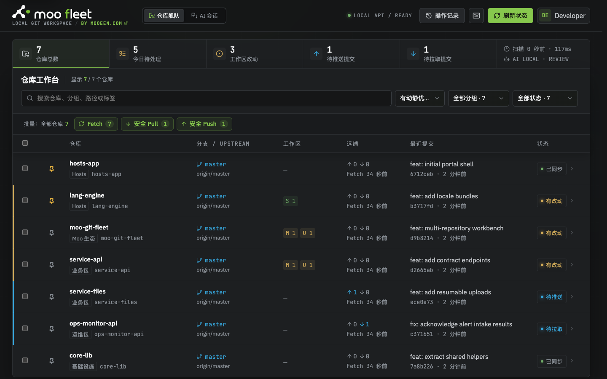

<p align="center">
  
</p>

<p align="center">
  本地优先的多仓库 Git 工作台<br>
  <a href="https://mooeen.com">MOOEEN 官网</a> ·
  <a href="https://gitee.com/charsen/moo-git-fleet">Gitee 主仓</a> ·
  <a href="https://github.com/charsen/moo-git-fleet">GitHub 镜像</a>
</p>



Moo Fleet 把散落在电脑中的 Git 仓库和本机 Claude / Codex 会话集中到一个桌面工作台。它可以安全执行日常 Git 操作，也能用你自己的私有 Git 仓库在两台电脑间备份和恢复 AI 会话；不会托管代码，也不会替代 IDE 或替用户解决冲突。

## 仓库工作台

- 从受信任根目录扫描并添加 Git worktree，也可预览并导入受信任根目录内的 `PACKAGES.md`；从列表移出仓库只改本机配置，不删除磁盘目录。
- 集中展示分支、Dirty、Staged、Ahead / Behind、Stash、最近 Tag 和最近 7 条 Commit。缺失路径仍保留在列表中，但不计入仓库总数，可经“清理缺失仓库”二次核验后移出配置。
- 默认将冲突、进行中操作、分叉、工作区改动和远端差异等“有动静”仓库排在前面；支持置顶、搜索、分组、今日待处理、需要关注、工作区改动、待推送、待拉取、久未 Fetch 等筛选，以及多种排序方式。
- 支持手工刷新、单仓或批量 Fetch / Pull / Push，以及浏览器打开期间的定时自动 Fetch。批量操作按配置限制并发，单仓失败不会中断其他仓库，失败或被安全阻止的条目可重新预检后重试。
- Pull 只允许 fast-forward；Push 会先 Fetch、复核远端状态并使用明确 refspec，永不 force。没有 upstream 时可关联可验证的远端分支，或经确认首次 Push 后建立 upstream。
- 可安全切换已有本地分支；执行前复核当前分支、HEAD、工作区和关联 Worktree 占用，不自动 Stash，不强制覆盖文件。
- Diff 提供 staged / unstaged 切换、双行号、Git 红绿语义和轻量语法染色，也支持未跟踪文件的全新增预览。
- 支持 Stage / Unstage、手工 Commit、AI Commit 文案、可选的提交后安全 Push，以及 Stash 创建、Apply 和永久删除。Commit 与 AI 建议都绑定当前 staged fingerprint，暂存区变化后必须重新预览。
- 丢弃单文件改动前会重新校验文件身份。已跟踪且仍存在的当前内容先进入系统废纸篓，再恢复 Git 版本；已删除的跟踪文件直接恢复；未跟踪文件进入系统废纸篓；已暂存、冲突和复杂重命名等高风险状态会被拒绝。
- 可从 Finder、Terminal、VS Code 或支持的代码托管网站打开仓库；Gitee、GitHub、GitLab 等可识别远端的最近 Commit 也可直接访问。
- 操作记录通过 SSE 实时更新，并区分成功、失败、正常无操作和安全阻止；日志按日期、大小和保留天数轮转。

## AI 会话

- 自动发现本机 Claude / Codex JSONL 会话，可搜索、筛选、排序、查看最近 200 条可读消息；列表支持按当前筛选结果多选，并把单条或一批本机会话移到系统废纸篓。
- 用一个自己管理的私有 Git 仓库在两台电脑间备份和恢复会话。Fleet 只读取所选仓库自己的 `origin`，不保存用户填写的 Git 地址。
- 本机 JSONL 是真相源，备份仓是 Fleet 管理的派生副本。内容相同或只有严格前后延伸时自动采用更完整的一方，真正分叉或遇到跨机删除时才要求用户决定。
- 远端不可用不阻塞本机备份；未推送的备份提交会在后续同步时继续上传。
- 详情可生成并复制 `claude --resume` 或 `codex resume` 命令，可选择附加 provider 的跳过权限确认参数。Fleet 只生成命令，不替用户启动 Claude 或 Codex。

完整规则见 [AI 会话备份与恢复](docs/AI-SESSION-SYNC.md)。

## macOS 应用

原生壳使用 WKWebView，后端使用随 App 打包并校验的官方 Node 运行时，不是 Electron 应用。构建链支持 Apple Silicon (`arm64`) 与 Intel (`x64`) 的独立安装包，最低支持 macOS 13.5，不生成 Universal 2。

```bash
npm ci
npm run build:mac       # Apple Silicon arm64
npm run build:mac:x64   # Intel x64
```

Apple Silicon 构建机安装 Rosetta 后，可运行 `npm run build:mac:all` 顺序构建两种架构。产物按架构隔离：

- `release/macos-arm64/Moo Fleet.app`
- `release/Moo-Fleet-<version>-macos-arm64.dmg`
- `release/macos-x64/Moo Fleet.app`
- `release/Moo-Fleet-<version>-macos-x64.dmg`

无 Developer ID 身份时生成 ad-hoc 签名的内测 DMG，并附带自包含的安装说明和辅助安装器；Developer ID 构建默认不包含内测安装文件。正式公开分发还必须完成 App 与 DMG 的签名、公证、装订和最终校验。

真实安装门禁会退出 App、挂载 DMG 并操作 `/Applications`，只有维护者明确确认后才能运行：

```bash
MOO_FLEET_INSTALL_E2E_CONFIRM=1 npm run test:mac-install-e2e
MOO_FLEET_INSTALL_E2E_CONFIRM=1 npm run test:mac-install-e2e:x64
```

构建、公证、Intel runner 和五回真实安装的完整流程见 [安装、升级与故障排查](docs/OPERATIONS.md)。

## 本地开发

需要 Node.js 20 或更高版本和 Git 命令行工具：

```bash
npm ci
FLEET_DEV_DATA="$(mktemp -d)"
mkdir -p "$FLEET_DEV_DATA/fleet" "$FLEET_DEV_DATA/claude" "$FLEET_DEV_DATA/codex"
GIT_FLEET_HOME="$FLEET_DEV_DATA/fleet" \
GIT_FLEET_CLAUDE_HOME="$FLEET_DEV_DATA/claude" \
GIT_FLEET_CODEX_HOME="$FLEET_DEV_DATA/codex" \
npm run dev
```

- Web：<http://127.0.0.1:5173>
- API：<http://127.0.0.1:8787>
- Vite 使用 `strictPort`；5173 被占用时会直接失败，不会自动换端口。
- Vite 的 `/api` 代理固定指向 `127.0.0.1:8787`，开发时不要单独修改 API 端口。
- 支持视口：1024 CSS px 及以上；移动端不在支持和验收范围内。

生产构建和源码模式启动：

```bash
npm run build
npm start
```

生产模式由 Fastify 在同一端口托管前端和 API，打开 <http://127.0.0.1:8787>。

常用检查：

```bash
npm run typecheck
npm test
npm run build
```

## 数据与安全

- macOS App 统一使用 `~/Library/Application Support/Moo Fleet` 保存配置、操作记录、AI Token、会话备份绑定和原生日志。
- 源码模式设置 `GIT_FLEET_HOME` 后，所有 Fleet 自有数据统一位于该目录。未设置时，常规配置、操作记录和 `deepseek_token` 使用当前工作目录，但会话备份绑定仍按平台数据目录解析；因此开发和自动化应显式设置临时 `GIT_FLEET_HOME`，涉及会话页时还要隔离 `GIT_FLEET_CLAUDE_HOME` 与 `GIT_FLEET_CODEX_HOME`。
- 服务默认只监听 `127.0.0.1`。写接口要求当前进程生成的 session token，并校验可信 Origin、Host 和受信任根目录。
- Git 凭据交给 SSH Agent、macOS Keychain 或 Git Credential Manager 管理；Fleet 禁止交互式凭据提示，也不保存托管平台账号、密码、Token 或 SSH 私钥。
- DeepSeek Key 只保存在 `GIT_FLEET_HOME/deepseek_token` 或进程环境中。每个仓库可禁用 AI、仅发送 Diff 统计，或发送脱敏 Patch；敏感路径始终强制留在本机。
- AI 会话同步只保存完整、换行结束且可恢复的 JSONL 记录，不复制源码、登录凭据、缓存、SQLite sidecar、锁文件或机器配置。
- 会话备份位置只允许空目录、无提交的空 Git 仓、Fleet 管理的备份仓，或经再次确认的可识别旧版 Vault；其他有内容仓库始终拒绝。

## 文档

- [安装、升级与故障排查](docs/OPERATIONS.md)
- [AI 会话备份与恢复](docs/AI-SESSION-SYNC.md)
- [实施设计与验证档案](GIT-FLEET-PLAN.md)

项目目录和 npm 包名继续使用 `moo-git-fleet`，产品名称为 `Moo Fleet`。
