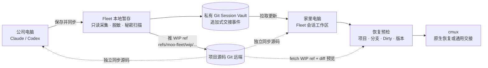

# AI 会话跨电脑同步与恢复方案

状态：产品讨论稿 v0.3（2026-07-27）<br>
适用对象：白天在公司、晚上在家，使用 Claude 和 Codex 辅助开发的个人开发者

> 这是一份可以直接进入产品评审的方案，不是对 Claude/Codex 内部目录格式的承诺。凡是供应商未公开、可能变化的能力，都必须经过本机探测，并且始终保留通用交接的兜底路径。

## v0.3 变更说明

本轮修订用 2026-07-27 在真实开发机上的实测结果替换了原稿中的若干假设，并修正了几个自相矛盾的设计：

1. 写入实测的 provider 存储形态、真实体量与 CLI shim 链现象（§6.2、§6.4、§7.2）。
2. 能力探测必须穿透 shim 链并校验帮助文本签名，结果改为 `supported`/`unsupported`/`unknown` 三态（§6.2、§6.4）。
3. **源码通道重设计**：默认把未提交改动打包成 WIP ref 推到项目自己的远端，Vault 不再默认存 `changes.patch`；新增「保存时的源码同步门」（§2.1、§4.4、§6.1、§14）。
4. 事件 schema 修正：删除 `updatedAt`/`lastCheckpoint`，`providerSessionId` 明文保存，新增接力链（lineage）规则（§4.1）。
5. 项目身份复用 Fleet 自己的仓库注册表，不再另造一套 `projectMappings`（§4.2、§7.1）。
6. 交接摘要改用「同 provider 无头 fork-resume 自摘要」，并禁止跨 provider 生成（§2.5）。
7. 砍复杂度：删除「C2 自动识别」承诺、远端可见性探测降级为增强、引用计数 GC 推迟到未来，容量手段改为分层 + 上限 + Vault 纪元轮换（§5.2、§5.4、§4.4）。
8. 新增「与供应商云端会话能力的关系」，明确重投 M1、轻投 M4 的战略取舍（§9.1）。
9. §10 由「分阶段落地」重写为「实现步骤与验收标准」，每一步给出可执行判据（§10）。

## 0. 产品决策摘要（先读这一页）

### 0.1 直接回答需求

| 需求 | 结论 | 产品做法 |
| --- | --- | --- |
| 把 Claude、Codex 目录提交到 Git | **可以保存，但不要直接提交原目录** | Fleet 只读采集，生成脱敏、可审阅的交接包，再写入专用私有 Session Vault |
| 换电脑 Pull 最新状态 | **可以** | 用户点击“拉取更新”，Vault 用追加式 checkpoint 合并，不覆盖任一方快照 |
| 浏览每个会话 | **可以** | 会话列表、摘要、时间线、分支/Dirty 状态和快照比较均可只读查看 |
| 管理和删除旧会话 | **应该作为核心能力** | 支持置顶、归档、移入废纸篓、恢复和批量清理；彻底清除 Git 历史是独立的高级操作 |
| 恢复会话 | **可以分级恢复** | 优先原生 resume；不兼容时生成通用 handoff，不阻塞继续工作 |
| 未提交的源码改动怎么带走 | **走项目自己的远端，不进 Vault** | 保存交接点时把未提交改动打包成 `refs/moo-fleet/wip/<checkpointId>` 推到项目远端；Vault 只记 ref 名和文件统计 |
| 复制指令到 cmux | **可以，复制是第一版基线** | 先展示并复制经 shell quoting 的命令；检测到兼容 cmux 后再提供“在 cmux 中打开” |

### 0.2 推荐的优先级

```text
有合规的常开主机、网络稳定
        └─► 远程工作区（同一原生会话，最少同步问题）

两台电脑都可能离线，或不能把源码放到远端
        └─► Fleet Session Vault（默认方案）
             ├─ 通用交接包（第一版必须可靠）
             └─ 原生会话胶囊（兼容时的增强能力）

直接 Git / iCloud / Dropbox 同步 ~/.claude、~/.codex
        └─► 不作为产品方案；完整目录备份由用户在 Fleet 之外自行管理
```

核心判断是：用户需要的是“在另一台电脑继续工作”，不是把一个正在运行的进程和机器缓存搬过去。原始目录同步会把凭据、锁文件、缓存、绝对路径和版本耦合问题一起带走，短期看似省事，长期最容易丢会话或泄露秘密。

### 0.3 第一版明确不做什么

为保证实际效果和交付速度，MVP 不应承诺以下行为：

- 不递归 `git add` 任意 `~/.claude`、`~/.codex` 或整个用户目录。
- 不同步 API Key、OAuth 登录态、Cookie、SSH 私钥、Keychain 内容或 Git 凭据。
- 不在后台不断提交正在写入的 transcript；同步由用户点击“保存交接点”触发。
- 不自动切换分支、覆盖 Dirty worktree、应用未预览的改动或 force push。
- 不把某个版本的 `claude`、`codex` 或 `cmux` 参数写死成永久协议。
- 不承诺“自动识别公司代码/内部信息”。敏感内容的边界靠**默认不采集原始上下文**，不靠猜测式分类器。
- 不复制 provider 的 SQLite 状态文件（Codex 的 `goals_*.sqlite` 等带 WAL，运行中直接复制得到的是损坏快照）。
- 不做引用计数式垃圾回收和 Git 历史重写；容量问题先用分层、上限和 Vault 纪元轮换解决。
- 第一版可以没有原生 session 导入，但必须有通用 handoff 和可复制的恢复指令。

这几个边界比“第一天就完整搬运原生会话”更重要：它们决定了功能能否在真实的公司/家庭双机环境中稳定使用。

### 0.4 本轮产品决策：MVP 默认不加密

MVP 使用“**明文但私有、严格脱敏的 Session Vault**”，不引入内容加密、恢复码或跨设备密钥迁移。这样可以保留 Git diff、全文搜索、直接浏览和故障排查能力，也显著降低两台电脑首次配置与恢复失败的概率。

这个默认值只在以下前提同时成立时适用：

- 两台电脑均由用户本人控制，磁盘与系统账号本身可信。
- Vault 使用本机仓库或用户确认的私有 Git 远端，不能是公开仓库。
- Fleet 只采集 provider 白名单数据，并在写入 Git 前执行秘密扫描和脱敏。
- 用户接受：任何有 Vault 文件或远端访问权的人都能直接阅读内容，Git 历史也可能长期保留已经删除的文本。

不满足这些前提时，Fleet 应阻止远端同步，或降级为只包含目标、决策和下一步的“轻量交接”。加密 Vault 可以作为未来的高级选项，但不进入 MVP，也不阻塞默认流程。

建议产品提供三种清晰模式：

| 模式 | 默认 | 保存范围 | 适用场景 |
| --- | --- | --- | --- |
| 私有 Vault | 是 | 结构化交接、工作区状态；原始上下文按需开启 | 本人控制的双机 + 私有远端 |
| 轻量交接 | 否 | 摘要、决策、下一步，不保存完整 transcript | 公司策略严格或只需快速接力 |
| 加密 Vault | 未来 | 与私有 Vault 相同，但内容对象加密 | 共享设备、受控密钥或合规要求场景 |

### 0.4.1 开源仓库不变量（不可绕过）

`moo-git-fleet` 是开源项目，因而“Session Vault 是另一个私有仓库”不是建议，而是硬性产品边界：

- 不允许把 Vault 放在本项目 Git 根目录、项目的 `.fleet/`、`docs/`、测试 fixture、截图、构建产物或任何会被开源仓库扫描到的路径中。
- 不允许把会话摘要、transcript、patch、native capsule、操作日志或本机索引提交到 `moo-git-fleet` 的 Git 历史。
- 首次设置时必须比较 Vault 工作树与当前开源项目根目录；路径相同、位于其子目录，或远端与开源项目远端相同，都直接阻止初始化。
- Vault 远端必须经用户输入确认短语确认为私有，UI 常驻 `私有（用户确认，未经 Fleet 验证）` 标签；未确认时只能本机保存或轻量 handoff。平台 API 自动验证可见性是后续增强，不是 MVP 门槛。
- 所有示例、测试 fixture 和文档中的会话内容都必须是合成数据，不得复制真实提示词、公司代码、内部 URL、用户名或路径。
- `.gitignore` 只能减少误操作，不能当作安全边界；开源项目还应在 pre-commit/CI 中拒绝 Vault 目录、transcript、handoff 导出物和秘密扫描命中项，并定期检查 Git 历史。

“不加密”不等于“可以把敏感信息提交到 Git”：MVP 的承诺是**敏感信息在进入任何 Git 对象之前就被排除或替换**。秘密扫描失败时默认硬阻止，不能用一个“仍然提交”的按钮静默绕过；误报例外只能保存为本机规则，不能把原文写进提交、日志或错误报告。

### 0.5 两条高频路径

面向用户的功能名建议使用「AI 会话接力」，`Session Vault` 只作为设置页和诊断信息中的技术名称。首页不要求用户理解 Commit、Push、Pull 或 checkpoint，只需要记住两个动作：

| 时机 | 用户看到的主按钮 | Fleet 做的事 |
| --- | --- | --- |
| 离开公司 | **保存并同步** | 采集摘要、检查项目状态、脱敏、秘密扫描、生成 checkpoint、Commit、Push |
| 到家开始工作 | **接着工作** | Pull、找到最新 checkpoint、映射项目路径、预检 Dirty/分支、生成 cmux 指令 |

每个主按钮内部可以展示“生成交接 → 安全扫描 → 同步”或“拉取 → 预检 → 恢复”的分步进度，但不把这些技术步骤拆成必须逐个点击的按钮。理想路径是一次主点击加一次确认。任何阻塞（未配置远端、远端隐私状态未确认、Vault 位于开源项目内、路径未映射、工作区不干净）都要出现在按钮旁边，并告诉用户下一步，而不是只弹“操作失败”。

## 1. 先给结论

建议在 Moo Fleet 中增加一个独立的「会话接力」工作区，但不要把 Claude/Codex 的原始运行目录直接当成普通 Git 仓库提交。

更稳妥、实际效果也更明显的方案是：

> **可移植交接包（Handoff Capsule） + 专用私有 Git 会话仓库（Session Vault） + Fleet GUI + cmux 恢复桥接**

每次准备换电脑时，Fleet 从本机的 Claude/Codex 目录读取会话摘要和可恢复信息，生成一个版本化、可审阅、默认明文但已脱敏的交接包，提交到专用私有会话仓库并 Push。对通过兼容性检查的会话，再额外保存一个“原生会话胶囊”（只包含该会话所需的白名单文件，而不是整个用户目录）。另一台电脑 Pull 后，Fleet 展示可恢复的会话，用户预览工作区差异，再一键生成恢复环境和 cmux 指令。

这个设计保留 Git 的可追溯性，同时避开原始 AI 运行目录里的缓存、凭据、机器绝对路径和不稳定内部格式。即使原生胶囊因版本不兼容无法导入，通用交接包仍然可以让用户继续工作。

### 1.1 三层恢复模型

不要把“同步成功”与“原生进程搬过去”混为一谈。每个会话应明确标出下面三层能力：

| 层级 | 保存内容 | 目标 | 失败时的兜底 |
| --- | --- | --- | --- |
| 工作交接 | 摘要、决策、下一步、项目状态 | 任何版本都能继续 | 始终可用 |
| 原生会话胶囊 | 适配器确认过的 session 文件片段 | 尽量保持原生上下文和 session ID | 降级为工作交接 |
| cmux 启动绑定 | cwd、provider、checkpoint、启动命令 | 一次操作打开新 workspace | 复制可审阅命令 |

因此，产品文案应说“可恢复级别：交接 / 原生 / cmux”，不要笼统显示“已同步”。

### 1.2 推荐架构



这里有两个独立同步面：项目源码（含未提交的 WIP）继续走各项目自己的 Git 远端；AI 上下文走 Session Vault。Fleet 只在保存时把 WIP 打包推到项目远端、在恢复预检时把两者关联起来，不把源码仓库、AI 会话仓库和本机登录状态混成一个仓库。

## 2. 需求拆解

### 2.1 真实需求不是“同步目录”

换电脑时真正需要带走的是：

1. 当前在做什么，以及下一步做什么。
2. AI 已经知道的上下文、决策和约束。
3. 对应项目的 Git 分支、提交和未提交改动。
4. 使用的是 Claude 还是 Codex、会话标题和最近活动时间。
5. 能在另一台电脑快速打开同一项目并继续工作。

而以下内容通常不值得同步，甚至不应该同步：

- API Key、OAuth Token、Cookie、SSH 私钥和 credential helper 数据。
- `node_modules`、缓存、索引、临时锁文件和机器级运行状态。
- 带有公司绝对路径、用户名或本机端口的内部数据库。
- 完整源码副本（源码本身已经由项目 Git 仓库管理）。

因此，产品应同步“可恢复的工作上下文”，而不是盲目复制“进程运行现场”。

技术上当然可以把两个目录复制到一个私有 Git 仓库，但那只能算“原始目录备份”，不能算可靠的会话同步：两个 provider 的全局配置、登录状态、缓存和机器路径会混在一起，Git 历史还会永久留下误提交的秘密。若用户确实需要完整备份，建议另做一次与 Fleet 分离的备份，并明确它不属于“会话接力”的恢复路径。

### 2.1.1 源码通道：未提交改动走项目自己的远端

上面第 3 条“对应项目的 Git 分支、提交和未提交改动”是真实需求，但它**不应该由 Session Vault 承担**。把未提交 diff 存进 Vault 会同时违反两条本方案自己的原则：源码由项目 Git 仓库管理，以及 C2 级内容默认不进 Vault。公司代码是最敏感的一类内容，没有理由为了带走它而在 Vault 里复制一份。

默认通道是 **WIP ref 推到项目自己的远端**：

1. 保存交接点时，Fleet 用 plumbing 在**不触碰用户 index/worktree/HEAD** 的前提下打包未提交改动（含 untracked）：设置临时 `GIT_INDEX_FILE` → 在该临时索引上 `git add -A` → `git write-tree` → `git commit-tree`。
2. 把生成的 commit push 成命名空间 ref，例如 `refs/moo-fleet/wip/<checkpointId>`。它不出现在常规分支列表、不影响 CI、不需要用户清理。
3. Vault 里只写 **ref 名 + 文件统计**（新增/修改/删除文件数、总字节、是否含 untracked），不写源码内容。

恢复侧对应：`git fetch` 该 ref → 展示与本地工作区的 diff 预览 → 用户确认后按文件应用。**永不自动 merge，也不自动覆盖任何本地文件。**

边界与回退：远端 hook 可能拒绝非常规命名空间的 ref；也可能用户根本不想让 WIP 出现在公司远端。此时按仓库可选择回退为普通 `wip/<checkpointId>` 分支，或退到最后一档——把 patch 写进 Vault（该档属于 C2，必须由该仓库显式开启，见 §5.2）。

**保存时的源码同步门（必须做）**：真实场景里最常见的翻车不是 Vault 丢数据，而是**人到家了、代码没 push**。因此保存流程必须检查“当前分支是否已推送、HEAD 在远端是否可达”，未推送时在保存界面给出三选：

| 选项 | 结果 | 恢复侧看到的能力标签 |
| --- | --- | --- |
| 推送分支 | 正常 `git push`，HEAD 在远端可达 | 代码可达 |
| 推送 WIP ref | 打包未提交改动为 `refs/moo-fleet/wip/<checkpointId>` | 代码可达（含 WIP） |
| 仍然只存交接 | 只保存摘要与工作区元数据 | **该 checkpoint 的代码在家不可达** |

选择结果写进 checkpoint 的能力标签，恢复预检据此提前提示，而不是等用户到家打开项目才发现代码不在。

### 2.2 不能假设原生会话一定可跨机器恢复

Claude Code、Codex 以及它们未来的版本可能改变会话文件格式、会话 ID、缓存位置和启动参数。某个版本能读取的内部目录，不代表另一台电脑或下一版本仍然能读取。

Fleet 应把“原生恢复”当作增强能力，而不是唯一通道：

- **通用恢复**：用交接包生成一份结构化恢复提示词，在新终端启动一个新会话，几乎不依赖供应商内部格式。
- **原生恢复**：只有穿透 shim 的三态探测返回 `supported` 时才显示，并标明兼容范围（见 §6.2）。

这样即使原生目录无法导入，用户仍能继续工作，不会被某个 AI 工具的内部实现锁死。

### 2.3 Git 是传输与历史，不是实时文件同步

会话仓库应采用“用户明确保存 → 生成快照 → Push”的节奏。不要让 Fleet 在 AI 正在写入 transcript 时直接对原始目录做 `git add -A`，也不要用 iCloud/Dropbox 与 Git 同时争抢同一组文件。这样可以避免半写入 JSONL、文件锁和冲突覆盖。

建议把每个交接点视为不可变事件：新交接点只新增文件，旧交接点只读保留，Git 中不提交一个由两台电脑共同改写的“当前版本”文件。Fleet 在本机根据事件关系计算最新版本。两台电脑同时从同一交接点继续时，会自然形成两个分支，界面显示“会话已分叉”，而不是用最后一次 Push 静默覆盖另一方。

这种追加式模型还有一个实际好处：Push 遇到 non-fast-forward 时，Fleet 可以先 Fetch/Rebase；因为两台设备通常新增的是不同路径下的事件文件，Git 能自动合并，只有业务上同一会话发生分叉时才需要用户决定，而不是让用户处理 JSON 冲突标记。

### 2.4 如果有常开主机，远程工作区可能更简单

还可以考虑另一条路线：把代码和 Claude/Codex 会话始终运行在一台受信任、可远程访问的主机（例如家里的 Mac mini、开发服务器或公司允许的远程工作区）上，两台电脑只通过 cmux 的 SSH workspace 或 provider 的 remote-control 连接。

它的优点是不会搬运原生 session 文件、不会做路径映射，也不会把对话写进 Git；看到的就是同一个正在运行的会话。缺点是需要主机持续在线、网络稳定，并且必须符合公司源代码和账号策略。

因此可以用下面的决策规则：

| 条件 | 推荐方案 |
| --- | --- |
| 有合规的常开主机，且经常在线 | 远程工作区优先，Fleet 管理连接和书签 |
| 两台电脑都可能离线 | Fleet Session Vault + 通用交接 + WIP ref |
| 项目源码根本不能推到任何远端 | Fleet Session Vault + 通用交接；源码通道不可用，checkpoint 标为“代码不可达”，用户自行用其他方式携带源码 |
| 只想带走下一步和少量上下文 | 仅保存轻量 handoff，不保存完整 transcript |

这也是为什么 Session Vault 应作为本地优先的第二条路径，而不是假设所有用户都必须同步完整 AI 目录。注意最后两行的边界：Fleet 从不替用户决定源码能不能出门，它只如实标出“这个交接点的代码在另一台机器上能不能拿到”。

### 2.5 交接摘要不能完全依赖猜测

“把最近几百条消息拼起来”不等于可靠的交接。不同 provider 的 transcript 结构和工具输出差异很大，Fleet 也不应该擅自替用户总结出一个看似正确、实际过时的下一步。

**首选机制是无头 fork-resume 自摘要**：让拥有全部上下文的原会话自己写交接。对已有会话执行一次一次性、非交互的调用，例如：

```sh
claude --resume "<claude-session-id>" --fork-session -p "<标准交接模板>"
```

`--fork-session` 保证这次调用产生的是一条分叉，**不污染原会话**，用户下次 `--resume` 看到的仍是原来的对话。模板要求输出结构化的 goal / completed / decisions / nextSteps / blockers / risks。Codex 侧在探测到 `codex exec resume` 的等价能力后启用同一机制。这条路径的关键好处是：**Fleet 不需要自建任何 AI 基础设施，也不需要自己解析 transcript 语义**。

这里的“首选”指**用户明确要求 provider 生成摘要之后的生成优先级**，不表示页面首次加载就自动调用。首次打开预览只生成本地启发式草稿；只有用户点击“调用当前 provider 原会话生成摘要（会消耗 token）”并通过写操作鉴权后，Fleet 才执行同 provider 的无头 fork-resume。这样既保留高质量摘要路径，也不会因查看页面而产生未确认的费用或外发动作。

完整优先级：

1. **无头 fork-resume 自摘要**：探测通过时的默认路径，如上。
2. **Provider 结构化导出**：适配器能直接读到明确的标题、最近目标和 checkpoint 时，直接采用，省掉一次调用。
3. **本地启发式 + 用户编辑**：会话已退出、CLI 不支持 fork-resume 或用户关闭了自摘要时，从最近消息和 Git 状态生成草稿，用户在提交前确认/修改。

成本与隐私的硬规则：

- 会话内容**只发给产生该会话的那个 provider**。这次调用不引入新的数据流向：内容原本就在这个 provider 手里。
- **交接摘要不得跨 provider 生成**——不把 Claude 的 transcript 发给 Codex，也不发给 DeepSeek 等任何第三方模型。Fleet 现有的 DeepSeek provider 只用于既有的仓库类功能，**不参与会话摘要**。仅本地启发式（不外发）不受此限。
- 自摘要是一次真实的 token 消耗，UI 要在调用前标明将要调用哪个 provider，并要求用户显式 opt-in；未选择时始终保留本地启发式草稿。

无论来源如何，提交前都应显示一个可编辑的预览，而不是把摘要悄悄写进远端。建议的最小字段如下：

```yaml
goal: ""
completed: []
decisions: []
nextSteps: []
blockers: []
commands: []
risks: []
source: provider-export | ai-generated | heuristic | manual
reviewedAt: ""
```

这样即使 Claude/Codex 的本地格式改变，用户仍能用同一套交接模板继续工作；同时 UI 可以明确标注“已由用户确认”或“仍是自动草稿”，避免把低置信度内容伪装成事实。

## 3. 推荐的产品形态

### 3.1 Fleet 中新增「会话接力」入口

顶层导航新增一个轻量的「会话接力」工作区，与现有仓库工作台并列。首次进入时用向导完成：

1. 选择要监控的 Claude、Codex 会话目录（也支持手动添加目录）。
2. 选择专用会话仓库的位置和远端。
3. 设置本机名称，例如“公司 Mac”“家里 Mac”。
4. 输入确认短语确认远端私有，确认数据分类、保留期限和“明文存储在私有 Git”提示。
5. 复核自动匹配结果：Fleet 用仓库注册表把发现到的会话对上已注册仓库，只有匹配不上的目录才需要用户手工指定一次（§4.2）。

之后的日常流程应控制在两个主要动作内：

- **准备离开**：选择会话 →「保存并同步」。
- **开始工作**：点击「接着工作」→选择会话 →确认恢复预检；cmux 可用时直接打开，不可用时复制指令。

Commit、Push、Pull、秘密扫描和 checkpoint 仍应显示在可展开的进度详情与操作记录中，方便诊断，但不占据高频路径的按钮层级。

### 3.2 会话列表应该回答三个问题

列表不要只显示文件名，而要让用户一眼知道：

| 信息 | 示例 | 用途 |
| --- | --- | --- |
| AI 工具 | Claude / Codex | 区分恢复方式 |
| 会话标题 | 重构分支切换流程 | 快速识别工作 |
| 项目与分支 | Moo Fleet · `feature/session-sync` | 确认恢复目标 |
| 来源设备 | 公司 Mac | 判断最新来源 |
| 最后交接 | 18:42 · 12 分钟前 | 判断是否需要 Pull |
| 工作区状态 | clean / 3 个未提交文件 | 避免覆盖本地改动 |
| 同步状态 | 已同步 / 有新版本 / 冲突 | 直接决定下一步 |

默认排序按“最近交接时间”，并提供「我的待处理」「有新版本」「有冲突」「全部」筛选。

Claude 和 Codex 的会话应保持为两个可独立恢复的对象，不要为了“统一”而把两份 transcript 串成一条对话。可以提供一个可选的“工作项”分组，把同一项目/分支下的 Claude 会话、Codex 会话和 Git checkpoint 放在一起；分组只是导航关系，不改变各 provider 的恢复边界。

### 3.3 会话详情页

详情页建议分成四个区块：

- **摘要**：当前目标、已完成事项、下一步、阻塞点。
- **上下文时间线**：关键用户指令、AI 决策、重要命令和最近交接记录。
- **工作区**：项目路径映射、分支、HEAD、未提交文件统计、WIP ref 及其可达性。
- **恢复**：兼容性检查、恢复预览、启动方式和「复制 cmux 指令」。
- **接力链**：这个逻辑会话在哪些机器、以哪种方式被接续过（见 §4.1）。

高风险动作（应用 WIP 改动、覆盖本地交接点、删除远端快照）必须显示变更预览，不做静默覆盖。

### 3.4 让“浏览”和“恢复”成为两个独立动作

用户通常先想确认“这是不是我昨晚做到一半的会话”，不一定马上要启动它。因此列表中的「查看」不应隐含恢复：

- **浏览**：以虚拟滚动时间线显示用户指令、AI 结论、工具调用摘要和交接点；敏感片段显示为已脱敏标记，原始内容只在已配置的本机权限范围内读取。
- **比较**：选择两个快照，查看目标、分支、未提交文件统计和上下文变化。
- **恢复**：通过路径、分支、脏工作区和 provider 版本检查后，才显示主按钮。
- **复制**：单独复制恢复提示词或 cmux 命令，复制前展示命令预览，不把 Token 或完整对话写进命令行。

这样“浏览会话”不会误触覆盖工作区，“恢复会话”也不会迫使用户先读完整 transcript。

### 3.5 推荐的桌面首屏

会话页的首屏应围绕“现在要不要交接/恢复”组织，而不是先让用户理解仓库内部结构。1024px 宽度下使用“筛选栏 + 列表 + 可关闭详情抽屉”，1440px 及以上再把详情抽屉固定在右侧。

```text
┌ 会话 ─────────────────────────────────────────────────────────────┐
│ 公司 Mac · Vault 已同步  │  [保存交接] [拉取更新]  [设置]          │
│ [待处理] [有新版本] [冲突]   搜索会话 / 项目…                      │
├───────────────────────────────────────────────────────────────────┤
│ ● Claude  重构分支切换流程                         有新版本        │
│   Moo Fleet · feature/session-sync · 公司 Mac · 18:42              │
│   下一步：补恢复预检       3 个未提交文件 · 通用恢复可用            │
│   [查看] [保存交接] [恢复]                                           │
│                                                                   │
│ ● Codex   批量 Pull 回归                          已同步 · 10:12   │
│   moo-git-fleet · master · 家里 Mac                               │
│   工作区 clean · 原生恢复不可用（可用通用 handoff）                │
└───────────────────────────────────────────────────────────────────┘
```

首屏的几个 UX 约束：

- “查看”永远是只读动作；不会启动 AI、改写 provider 目录或修改项目工作区。
- “恢复”先打开预检抽屉，再由用户确认；按钮旁直接显示路径、分支、Dirty 和 WIP 改动风险。
- “复制 cmux 指令”是独立动作，不把复制命令和应用 WIP 改动绑在一起。
- 状态使用图标、文字、来源设备和时间共同表达；颜色只能辅助，不能单独承载“冲突/失败”。
- 会话列表支持上下键、Enter 查看、Esc 关闭抽屉；关闭后焦点回到触发按钮。

### 3.6 状态机要让用户看懂

Fleet 内部可以用更细的状态，但界面只呈现下面这组可行动状态：

| 状态 | 用户含义 | 主动作 |
| --- | --- | --- |
| 本机草稿 | 已保存到本机，远端还没有 | 同步到远端 |
| 已同步 | 本机与 Vault 一致 | 查看 / 保存新交接 |
| 远端有新版本 | 另一台电脑有新的 checkpoint | 拉取并查看 |
| 需要路径映射 | 找不到本机项目目录 | 选择目录 |
| 需要预检 | 分支、Dirty 或 WIP 改动尚未确认 | 查看恢复预检 |
| 代码不可达 | 保存时选了“仅存交接”，分支/WIP 没推到远端 | 回原机器推送，或只看交接内容 |
| 已分叉 | 两台电脑从同一 checkpoint 各自继续 | 选择分支 / 合并为新交接 |
| 已降级 | 原生恢复不兼容，但通用 handoff 可用 | 复制通用恢复指令 |
| 同步失败 | 数据仍保存在本机，尚未 Push | 重试同步 |

不要把“已同步”当成“可原生恢复”。列表应该另外显示能力标签：`通用交接`、`原生恢复`、`cmux 可打开`、`代码可达`，这样用户不会把 Git Push 成功误解为进程已经跨机器搬运成功，也不会把“Vault 已同步”误解为“代码在家拿得到”。

### 3.7 会话管理：归档、删除与保留策略

“查看”解决的是找回上下文，“管理”解决的是让 Vault 长期可用。会话列表必须提供独立的生命周期操作，而不是只会不断累积 checkpoint：

| 操作 | 默认结果 | 可否恢复 | 是否影响 provider 原始目录 |
| --- | --- | --- | --- |
| 置顶 | 标记为重要，清理时跳过 | 是 | 否 |
| 归档 | 从“活跃”列表隐藏，内容仍可搜索和恢复 | 是 | 否 |
| 移入废纸篓 | 写入同步的删除标记，在所有设备隐藏 | 建议保留 30 天 | 否 |
| 清空废纸篓 | 从当前 Vault 工作树移除已过保留期的 checkpoint 对象目录；Git 对象库和远端历史不会因此缩小 | 仅靠 Git 历史/备份，不能承诺一键恢复 | 否 |
| Vault 纪元轮换 | 新建一个 Vault 仓库继续写入，旧仓库整体归档为只读 | 旧纪元始终可查 | 否 |
| 清理 Git 历史 | 重写远端历史，尝试从仓库对象中彻底移除 | 否 | 否 |

对象目录按 `checkpointId` 独占、不跨会话共享，因此清空废纸篓只需按保留期删除整个目录，**MVP 不做引用计数式垃圾回收**。真正的容量问题用「纪元轮换」解决：Vault 超过阈值时引导用户新开一个 Vault 仓库、旧仓库归档只读，这比历史重写和对象 GC 简单一个量级，也不需要任何 force push。

交付节奏：M1 实现置顶与归档；移入废纸篓、30 天保留、清空废纸篓与纪元轮换引导在 M2；“清理 Git 历史”留到未来版本，它是危险的高级工具，不能伪装成普通删除（见 §10）。因为本方案默认不加密，删除确认必须明确写出：**从列表删除不等于从 Git 历史抹除**。若曾误提交凭据或其他敏感信息，应立即轮换凭据，并按远端平台流程执行历史清理；Fleet 可以提供检查清单，但不应在没有额外确认和备份的情况下自动 force-push。

建议的管理体验：

- 默认只显示“活跃”会话，提供「已归档」「废纸篓」「全部」筛选，并支持按项目、provider、设备、最后交接时间和占用空间过滤。
- 提供“建议清理”视图：默认标记超过 90 天没有新 checkpoint、没有置顶、没有未同步内容且没有活跃子分支的会话；只提出建议，不自动删除。
- 批量操作先展示数量、总大小、最后活动时间、关联分叉和恢复能力，再让用户确认。存在本机待 Push、远端冲突或其他设备未 Pull 时，禁止直接清空。
- 删除一个会话只改变 Session Vault 的生命周期状态，不删除 `~/.claude`、`~/.codex` 原始会话，不删除项目源码，也不删除 cmux workspace；这几个范围必须在确认框中分开显示。
- 删除事件本身也要进入 Vault 的生命周期日志，确保另一台旧电脑 Pull 后不会把已删除会话重新显示出来。旧设备若继续从已删除会话创建 checkpoint，应显示“已删除会话产生新内容”，要求用户显式恢复或另存为新会话。
- 如需释放本机 provider 目录空间，可另设“清理本机来源”流程：先按 provider、大小和最后访问时间预览，再逐设备明确确认；它不随 Vault 删除事件同步，也不能默认删除供应商原始文件。

## 4. 数据结构：追加式交接事件，不同步原始目录

建议会话仓库采用如下结构：

```text
session-vault/
├── vault.yaml                    # 仓库版本、隐私模式、保留策略、schema 版本
├── events/                       # 只追加，不原地改写旧事件
│   ├── company-mac/
│   │   └── <ulid>.json           # checkpoint 与生命周期事件的脱敏元数据
│   └── home-mac/
│       └── <ulid>.json
├── objects/                      # 事件引用的脱敏交接内容（MVP 明文）
│   └── <checkpoint-id>/
│       ├── handoff.md             # 人类可读交接摘要
│       ├── workspace.json        # 项目、分支、commit、WIP ref 名与文件统计；不含源码、不含本机绝对路径
│       ├── transcript.ndjson     # 可选（默认关闭）：当前 checkpoint 的增量上下文
│       ├── changes.patch         # 回退档，默认不存在：仅在该仓库显式开启 C2 且 WIP ref 通道不可用时写入
│       └── native/               # 可选：适配器白名单文件
│           ├── manifest.json
│           └── files/...
```

本机搜索索引、绝对路径映射和临时预览缓存放在 Fleet 自己的数据目录，例如 `.fleet/index.sqlite` 对应的应用数据区，不提交到 Vault。这样换电脑只需要重新建立一次路径映射，也不会把公司或家庭电脑的目录结构写进 Git 历史。Vault 目录本身必须位于开源项目之外，并在初始化时做路径和远端隔离检查。

### 4.1 交接事件的最小字段

```json
{
  "schemaVersion": 1,
  "eventType": "checkpoint",
  "eventId": "01K123...",
  "checkpointId": "checkpoint-content-id",
  "parentCheckpointIds": ["previous-checkpoint-id"],
  "resumedFromCheckpointId": null,
  "sessionId": "stable-id",
  "provider": "claude",
  "providerSessionId": "0f2b1c84-6d3a-4e91-b7c5-2ad9e6f10b33",
  "title": "重构分支切换流程",
  "projectId": "moo-git-fleet",
  "branch": "feature/session-sync",
  "head": "abc1234",
  "machine": "company-mac",
  "createdAt": "2026-07-26T09:00:00Z",
  "payloadPath": "objects/checkpoint-content-id",
  "capabilities": {
    "nativeResume": false,
    "universalHandoff": true,
    "codeReachable": true,
    "wipRef": "refs/moo-fleet/wip/checkpoint-content-id"
  }
}
```

三点需要解释：

**事件是不可变的，因此没有 `updatedAt`、`lastCheckpoint` 这类字段。** 一个只追加、永不改写的事件不可能有“更新时间”；“这个会话最后一次交接是什么时候”属于派生状态，由本机索引遍历事件流计算。采集过程自身的时间戳（开始、结束、耗时）放在 payload 的 manifest 里，属于那一次采集的事实，不属于事件的可变状态。

**`providerSessionId` 明文保存 UUID，不脱敏。** 会话 UUID 是 C0 级公共元数据，本身不含任何内容；把它抹掉或只留本机映射，会直接毁掉原生恢复和接力链追踪——另一台机器拿不到 ID 就无法 `--resume`。要脱敏的是**内容**，不是**标识符**，这两件事不能混。

**接力链（lineage）规则。** 通用恢复在另一台机器上必然创建一个**新的** providerSessionId：Claude 在家里开的是新会话，它不可能是公司那个会话。这些 provider 会话都挂在同一个 Fleet `sessionId` 下，事件用 `resumedFromCheckpointId` 记录“我是从哪个交接点接上来的”。于是：

- 会话列表按**逻辑会话**（Fleet `sessionId`）聚合，用户看到的是一条连续的工作线，不是一堆碎片。
- 会话详情显示完整接力链：哪台机器、哪个 provider 会话 ID、用的是通用恢复还是原生恢复、接自哪个 checkpoint。
- 原生恢复成功时 providerSessionId 可以保持不变，此时接力链上是同一个 ID 出现两次——这本身就是“原生恢复真的生效了”的证据。

完整对话、提示词和 native capsule 只有在通过白名单与秘密扫描后，才可以按用户选择写入私有 Vault；MVP 不对它们加密，因此任何进入对象目录的内容都必须被视为 Vault 访问者可读的明文。未提交源码不走这条路（见 §2.1.1）。

生命周期事件使用同一个追加式事件流，例如：

```json
{
  "schemaVersion": 1,
  "eventType": "lifecycle",
  "eventId": "01K124...",
  "sessionId": "stable-id",
  "action": "trash",
  "machine": "company-mac",
  "createdAt": "2026-07-26T18:45:00Z",
  "retentionUntil": "2026-08-25T18:45:00Z",
  "reason": "用户手动清理"
}
```

索引根据所有事件计算 `active`、`archived`、`trashed`、`restored` 等状态，不原地改写旧 checkpoint。这样删除标记可以跨设备同步，也能解释“为什么这个会话不再出现在列表中”。

事件引用的 native manifest 还应记录原生胶囊状态，避免把“有 session ID”误认为“一定能恢复”：

```json
{
  "nativeCapsule": {
    "status": "verified",
    "providerVersion": "detected-at-capture",
    "formatVersion": "adapter-format-or-unknown",
    "files": [
      { "path": "files/session-record", "sha256": "...", "bytes": 12345 }
    ],
    "restoreCheck": "passed"
  }
}
```

`status` 至少区分 `verified`、`unsupported`、`not-captured`、`restore-failed`。原生胶囊只由 provider adapter 生成，不允许 UI 递归打包整个 `~/.claude` 或 `~/.codex`。

### 4.2 项目身份不能依赖绝对路径

公司和家里的项目路径很可能不同，不能把 `/path/to/project` 之类的绝对路径直接当作会话身份。

但这里**不需要另造一套映射表**：Fleet 本身就是仓库管理器，两台机器本来就已经在 Fleet 里各自注册了同一个项目的本地路径和远端。原稿设计的独立 `projectMappings` 是在重复实现 Fleet 已有的能力。正确做法是复用 Fleet 的仓库注册表：

- `projectId` **优先由 Fleet 仓库注册表中的规范化远端 URL 推导**（去除内嵌凭据、统一 scheme/大小写/`.git` 后缀）。同一个远端在两台机器上必然规范化到同一个 `projectId`。
- 恢复侧的路径映射 = 在本机 Fleet 注册表里按同一个规范化远端查找仓库。**找到即自动完成映射，用户什么都不用做。**
- 找不到时才提示用户选择目录，并顺带建议“把这个仓库添加进 Fleet”——因为加进去之后，这个项目的后续所有会话都不再需要手工映射。
- 没有远端的本地项目，用用户确认过的本地项目标识兜底。

`SessionDiscoveryService` 负责把 provider 侧的路径信息提取出来并 join 到 Fleet 仓库 id：Claude 侧解码 `~/.claude/projects/` 下的路径编码目录名，Codex 侧从 rollout 文件里提取 `cwd`（见 §7.2）。

独立的 `projectMappings` 配置只保留给**未注册进 Fleet 的目录**这一种情况：

```yaml
# 仅用于 Fleet 仓库注册表里查不到的目录
projectMappings:
  local-scratch-project:
    localPath: /path/to/scratch
```

### 4.3 原生胶囊的捕获与还原边界

原生胶囊不是把文件“原地覆盖”到另一台电脑。安全流程应是：

1. 适配器读取当前 CLI 版本、会话格式和该会话的最小依赖文件。
2. 只复制白名单相对路径，去掉绝对路径、凭据和机器级配置，并记录 checksum。
3. 在 Vault 的临时 staging 目录写入已脱敏的明文对象，并在写入前后校验路径和大小。
4. 目标电脑运行 dry-run，确认 provider 版本、项目身份和 session ID 可接受。
5. 用户确认后，适配器备份本机对应文件，再写入 native store；任何一步失败都保留通用交接路径。

**落点规则是确定性的，可以直接写出来**（基于 §7.2 的实测形态，仍需每次探测确认）：

| provider | 捕获 | 目标机落点 |
| --- | --- | --- |
| Claude | 该会话的 `~/.claude/projects/<源机路径编码目录>/<sessionId>.jsonl` | `~/.claude/projects/<按**目标机**项目绝对路径重新编码的目录>/<sessionId>.jsonl` |
| Codex | 该会话的 `~/.codex/sessions/<yyyy>/<mm>/<dd>/rollout-<ts>-<uuid>.jsonl` | 按文件自身时间戳落到目标机的 `~/.codex/sessions/<yyyy>/<mm>/<dd>/` |

Claude 侧的“路径映射”到此为止就是全部实现：**把目录名按目标机的项目绝对路径重新编码，文件名（sessionId）保持不变**。因为 Claude 会话与项目的关联在字面上就是由这个编码目录名决定的，所以重编码之后 `claude --resume <sessionId>` 在目标机上就能看到这个会话。这里没有隐藏的注册表要写，也没有内部数据库要改。

无论哪个 provider，**SQLite 状态文件一律不进胶囊**（见 §7.2）。

如果供应商没有稳定的导入接口，第一版可以只做“原生胶囊导出 + 可选还原”，不把它作为验收必需项。这样不会因为一次 CLI 升级阻塞跨电脑交接。

### 4.4 增量与容量策略

Vault 的体量压力主要来自两处：完整 transcript 里的工具输出，以及被误放进来的源码。后者已经在 §2.1.1 解决——**源码和未提交改动根本不进 Vault**。剩下的 transcript 问题，MVP 只用三个简单手段，不做引用计数 GC：

1. **分层默认**：交接摘要和结构化工作区默认开，原始上下文默认关（见 §4.6）。绝大多数用户在默认配置下，一个 checkpoint 只有几十 KB。
2. **单快照上限**：单个快照超过可配置上限（例如 50 MB）时先显示估算大小和排除选项，再允许提交；开启原始上下文时按 checkpoint 只保存新增段，超大工具输出只留摘要和本地引用，并在 UI 标出“未同步原始输出”。
3. **Vault 纪元轮换**：Vault 总体积超过阈值时，引导用户新开一个 Vault 仓库继续写入、把旧仓库归档为只读。旧纪元仍可搜索、可查看、可导出，只是不再接收新 checkpoint。

第 3 条是本轮刻意做的取舍：**它比引用计数垃圾回收和 Git 历史重写简单一个量级**，不需要 force push，不会破坏任何设备已有的克隆，也不存在“算错引用把还在用的对象删了”这类事故。引用计数 GC 与历史清理指引留到未来版本，不进 MVP，也不进 M2。

废纸篓与 30 天保留期属于生命周期功能而不是容量手段，放在 M2（见 §10）。

### 4.5 Git 的安全边界（必须写进实现验收）

Fleet 的 Git 工作目录和 provider 原始目录必须是两个完全不同的路径。实现上建议把 Vault 放在应用数据目录或用户明确选择的独立目录中，例如：

```text
~/Library/Application Support/Moo Fleet/
└── session-vault/
    ├── staging/       # 每次捕获的临时目录，完成后清空
    ├── repo/          # 专用 Git working tree；不是项目源码仓库
    └── index.sqlite   # 本机索引，不进入 Git

~/.claude/             # 仅作为只读采集源，不是 Git worktree
~/.codex/              # 仅作为只读采集源，不是 Git worktree
```

一次“保存交接点”的真实顺序应当是：

```text
读取（只读）
  → 生成通用摘要（同 provider 无头 fork-resume）/ workspace 状态
  → 源码同步门（检查分支是否已推送；按用户选择 push 分支 / push WIP ref / 仅存交接）
  → 选择性读取 transcript 增量
  → 秘密扫描（失败即停止）
  → 写入 staging 并执行最终秘密扫描
  → 原子 rename 到 objects/
  → 生成 append-only event
  → Git commit
  → 用户确认后 Push
```

任何步骤失败，都要保留本机 checkpoint，并把状态标成“仅本机保存”。不要出现“UI 显示已同步，但 Git commit 尚未落盘”或“Push 失败后删掉待同步数据”的情况。测试应明确断言：即使进程在序列化、秘密扫描、Commit 或 Push 的任意阶段被终止，下一次启动也能发现并继续处理未完成的本机 checkpoint。

### 4.6 内容分层能显著降低容量和隐私风险

不要每次都把完整 transcript 重新提交。建议将 checkpoint 分成三个可独立开关的层：

| 层 | 默认 | 说明 |
| --- | --- | --- |
| 交接摘要 | 开启 | 目标、已完成、下一步、阻塞、关键决策；用于首屏和通用恢复 |
| 结构化工作区 | 开启 | projectId、分支、HEAD、Dirty 统计、WIP ref 名与文件统计 |
| 原始上下文 | 关闭或按需 | 用户/助手消息和工具输出；按增量保存，默认不写入，可设置大小上限 |

这样用户即使关闭“原始上下文同步”，也仍然拥有足够可靠的交接结果。列表和搜索只依赖脱敏 manifest；只有打开时间线或执行恢复时才按需加载大对象。

## 5. Git 与隐私策略

### 5.1 专用会话仓库，而不是项目仓库

会话仓库必须与源码仓库分离，尤其不能使用开源的 `moo-git-fleet` 仓库作为 Vault：

- 会话内容可能包含跨项目上下文、公司代码、内部链接或个人信息，不适合进入开源项目的提交历史。
- 项目仓库的协作者不一定应该看到个人 AI 对话；源码仓库的公开性也不能由 Fleet 猜测。
- 一个会话可以关联多个项目或多个 Worktree，应该由独立 Vault 统一管理。
- Vault 可以放在应用数据目录中的独立 Git worktree，或用户明确选择的独立仓库；初始化时必须检查路径、远端 URL，并要求用户以确认短语确认远端归属。

首次版本可以使用用户自己的私有 Git 远端（自建、公司 Git、GitHub/Gitee 私有仓库均可），但 Fleet 不保存远端密码，继续使用系统 SSH Agent、Keychain 或 credential helper。这里的 Keychain 只用于 Git 登录凭据，不用于保存会话加密密钥；MVP 根本不生成会话加密密钥。

### 5.2 MVP 默认不加密：先把敏感内容挡在 Git 之外

默认保存的是“明文但私有”的对象，便于 Git diff、搜索、浏览和修复。这个选择不降低脱敏要求，反而要求更严格的写入前边界：

1. **远端归属确认（MVP 为用户确认，不是自动验证）**：MVP 要求用户输入一句确认短语，确认“这是我控制的私有远端”，之后 UI **常驻**显示 `私有（用户确认，未经 Fleet 验证）`。没有输入确认短语时不能启用远端同步，只能本机保存或轻量 handoff。通过平台 API 自动探测可见性是**后续增强**，不是 M2 的门槛——Fleet 不假装自己验证过一件它没验证过的事。
2. **采集白名单**：只读取 provider adapter 选出的会话字段，不递归提交 `~/.claude`、`~/.codex` 或整个用户目录；不采集 API Key、OAuth 登录态、Cookie、SSH 私钥、Keychain 内容、Git 凭据、`.env` 和 credential helper 数据。
3. **秘密扫描硬门槛**：扫描摘要、用户/助手消息、工具输出、native 文件、文件名、恢复命令，以及回退档 patch（若启用）。命中疑似秘密时停止 commit，给出本机可定位的类型和位置；日志只保留哈希、类型和行号，不复制原文。脱敏后用稳定的 `[REDACTED:<type>]` 占位符重新预览，不能静默放行。
4. **原始上下文逐会话显式 opt-in**：摘要和工作区状态默认同步；**原始 transcript 与工具输出默认根本不采集**，只有用户对某个具体会话显式开启后才进入 Vault，开启时一次性警示“该会话的原始内容将以明文形式对所有 Vault 可读者可见”。<br>这里要诚实：Fleet **无法自动识别**哪段文本是公司源代码、哪个是内部 URL、哪句是个人信息——正则和启发式在这类判断上必然大量误报和漏报，把它写成产品承诺等于骗用户。边界靠“默认不采集”守，不靠猜测式分类器。秘密扫描只负责有确定特征的 C3（key、token、私钥块），不冒充 C2 识别器。
5. **用户确认**：首次启用完整 Vault 时显示“内容以明文保存于私有 Git，Git 历史会保留过去版本”的一次性确认；之后在同步按钮旁保持紧凑的隐私状态，不重复打断正常操作。

建议把分类直接写入 checkpoint manifest，避免“秘密扫描没命中”被误解为“内容公开无风险”：

| 分类 | 示例 | `moo-git-fleet` 开源仓库 | 私有 Session Vault | 默认动作 |
| --- | --- | --- | --- | --- |
| C0 公共元数据 | provider、用户确认的标题、时间、状态 | 永不写入运行数据 | 可写 | 同步 |
| C1 脱敏交接 | 目标、决策、下一步、分支和统计 | 永不写入运行数据 | 可写 | 默认同步 |
| C2 敏感上下文 | 原始 transcript、工具输出、未提交源码 patch | **禁止** | 仅在该会话/该仓库显式开启后可写 | **不采集**，除非该会话显式开启 |
| C3 凭据/秘密 | API Key、Token、Cookie、私钥、密码、`.env` | **禁止** | **禁止** | 永久阻止并提示处置 |

C2 的判定标准是**数据类别**（“这是原始上下文”“这是源码 patch”），不是内容语义（“这段看起来像公司代码”）。前者机器判得准，后者判不准——分级表的可执行性完全建立在这个区别上。

这里的“永不写入运行数据”表示开源源码仓库不接收任何真实 Session Vault 产物；文档和测试只能使用合成样例。即使 C0/C1 本身不敏感，也应写入独立私有 Vault，而不是借用开源项目的 Git 历史。

如果未来需要加密，`加密 Vault` 应作为独立模式设计密钥注册、恢复、轮换和迁移；它是增强项，不应在 MVP 文档或验收中作为前置条件。

### 5.3 提交模型

- 本机可自动保存未提交的临时 checkpoint，保存在 Fleet 应用数据目录，不推送。
- 只有用户点击「同步到会话仓库」且远端隐私门槛通过后，才生成 Git commit 和 Push。
- 每次同步新增一个不可变事件和一组已脱敏的明文对象；不直接重写旧快照，也不提交共享的“当前版本”指针。
- Fleet Pull 后在本机重建会话索引，并根据父 checkpoint 关系计算每个会话的一个或多个最新 head。
- Push 被远端新提交拒绝时，Fleet 自动 Fetch/Rebase 后重试；若只是不同设备新增事件，不要求用户处理 Git 冲突。
- Push 失败时保留本地待同步状态，并明确显示“已保存到本机，尚未到远端”。
- 两台电脑同时编辑同一会话时，不覆盖任何一方，生成“会话已分叉”状态并允许“继续其中一条”“合并为新交接点”“拆成两个会话”。

“最新”不能只按两台电脑的本地时间排序。Fleet 应以 checkpoint 的父子关系、Vault Git 提交和设备来源共同判断；设备时钟漂移时仍保留两条事件，并在 UI 写出“根据远端历史判断”或“时间仅供参考”。这样用户看到的“最新”是可解释的历史结果，而不是最后一次上传恰好覆盖了另一台电脑。

### 5.4 删除、保留期与 Git 历史

- 归档、移入废纸篓、恢复都写成追加式生命周期事件；索引在 Pull 后按事件顺序重建，删除状态不会因旧设备重新扫描而复活。
- 清空废纸篓只按保留期删除**整个 checkpoint 对象目录**。对象目录按 `checkpointId` 独占、不跨会话共享，所以不需要计算引用关系；**MVP 与 M2 都不做引用计数式垃圾回收**。删除操作本身仍会留下 Git commit，`.git/objects` 与远端占用不会因此自动减少。
- 仓库整体变大时的正解是 **Vault 纪元轮换**（§4.4），不是 GC：新开一个 Vault 仓库、旧仓库归档只读。这条路径没有 force push，也不会让任何设备的已有克隆失效。
- 普通删除不承诺抹除 Git 历史。UI 必须同时显示“当前 Vault 已隐藏/移除”和“历史版本仍可能存在”两条结果。
- “从 Git 历史清理”属于**未来版本**的高级流程：先列出受影响的 commit、要求用户备份并确认所有设备已停止 Push，再由用户选择是否执行历史重写。MVP 与 M2 都不提供它，只在误提交处置清单（§5.5）里给出人工操作指引。
- 如果一台设备在收到 `trash` 事件后继续产生 checkpoint，Pull 时标为“删除与新内容冲突”，不能自动删除新内容，也不能静默恢复旧会话。

### 5.5 误提交敏感信息的处置

若扫描漏报或用户误操作导致敏感信息进入任何 Git commit，Fleet 应立即停止后续 Push，并显示一份不含原文的处置清单：撤销/轮换凭据、记录受影响的远端和 commit、隔离本地 Vault、联系远端管理员并按平台流程清理历史。删除工作树文件不是补救措施；在确认历史清理完成前，界面应持续显示“可能已暴露”。

## 6. 恢复流程

### 6.1 通用恢复（第一版必须支持）

1. 在家里电脑点击「拉取更新」。
2. 选择会话，查看摘要、接力链、分支和最近快照。
3. Fleet 经 Fleet 仓库注册表自动定位本地项目（§4.2），检查 HEAD 是否匹配、工作区是否干净。
4. 若该 checkpoint 带 WIP ref，`git fetch` 该 ref，显示文件列表和与本地工作区的 diff 预览；用户确认后**按文件**应用，永不自动 merge 或覆盖。若保存时选的是“仅存交接”，这里直接提示“该 checkpoint 的代码在家不可达”，并给出回原机器推送的指引。
5. 生成 `handoff.md` 和结构化上下文文件。
6. 根据当前工具生成启动命令或恢复提示词。
7. 用户点击「复制 cmux 指令」，粘贴执行，打开一个新的 cmux pane/window。

通用恢复不依赖供应商的 session ID，它会在本机创建一个**新的** provider 会话，并作为接力链的新一环挂在同一个 Fleet 会话下（§4.1）。即便 Claude/Codex 内部格式升级，用户仍能看到完整摘要和关键上下文，并继续工作。

### 6.2 原生恢复（可选增强）

Fleet 启动时探测本机 CLI 版本和能力，例如：

- 是否支持 `resume` / `continue` / `fork-session` / `import`。
- 是否能通过稳定 ID 读取会话。
- 当前会话格式的 schema 或版本。

**探测必须穿透 shim 链，不能只跑 PATH 上的 `--help`。** 2026-07-27 实测（见 §6.4）：本机 `which claude` / `which codex` 解析到的都不是真实 CLI，而是 cmux 注入的 CLI shim；`codex --help` 打出来的甚至是另一层包装器（codex-hud）的帮助文本。**在这种机器上，天真的 `--help` 探测会得到一个自信但错误的答案。** 因此探测要做两件事：

1. **解析真实二进制**：跟随 shim/包装脚本，尽量解析到实际被执行的可执行文件，并记录其路径与版本。
2. **校验帮助文本签名**：输出必须匹配该 provider 的特征。像 codex-hud 那样的帮助文本，直接判定为“这不是 codex”。

探测结果是**三态**，不是布尔：

| 结果 | 含义 | UI 行为 |
| --- | --- | --- |
| `supported` | 解析到真实二进制、签名匹配、版本在支持范围 | 显示“原生恢复（当前版本支持）” |
| `unsupported` | 确认是该 CLI，但版本/参数不支持 | 明确说明原因，退回通用恢复 |
| `unknown` | 签名不匹配、找不到真实二进制、或被包装器遮蔽 | 显示“无法确认本机 CLI 能力”，退回通用恢复 |

原则是**只降级、不误判**：宁可显示 `unknown` 让用户走通用恢复，也不能因为探测到一个包装器就宣称原生恢复可用。探测到的真实二进制路径和版本写入能力缓存，供命令生成使用（见 §6.4）。探测失败从不把用户挡在流程外。

### 6.3 cmux 桥接

不要让 Fleet 直接注入正在运行的终端进程；更安全的设计是生成可审阅的命令：

```text
打开 cmux → 新建窗口 → 进入项目目录 → 检查分支 → 启动 Claude/Codex → 载入 handoff.md
```

GUI 提供三个动作：

-「复制恢复指令」：复制当前 shell 可执行的一整段命令。
-「复制恢复提示词」：只复制给 AI 的上下文，不包含 shell 命令。
-「在 cmux 中打开」（可选）：检测到 cmux CLI 后，经用户确认调用；未安装时退回复制。

命令模板应由 provider adapter 生成，并允许用户在设置中编辑。不要把某个版本的 cmux 参数硬编码成不可修改的协议。

### 6.4 当前 CLI 能力下的命令生成

Fleet 不需要猜测某个会话的 ID 是否能用；启动时按 §6.2 的方式做穿透 shim 的能力探测，并把**真实二进制路径 + 版本 + 三态结果**写入能力缓存。以当前常见命令形态为例，适配器可以生成下面这类**示意命令**（实际输出必须做 shell quoting，并由用户在 GUI 中确认）：

```sh
# Claude：原生恢复
cd "/path/to/project" && claude --resume "<claude-session-id>"

# Codex：原生恢复
codex -C "/path/to/project" resume "<codex-session-id>"

# 通用恢复：从本地交接提示词启动新会话
cd "/path/to/project" && claude "$(cat .fleet/handoffs/<stable-id>/resume-prompt.txt)"

# cmux：新建 workspace 并启动命令
cmux new-workspace \
  --name "Moo Fleet · 重构分支切换流程" \
  --cwd "/path/to/project" \
  --command 'codex -C "/path/to/project" resume "<codex-session-id>"'
```

如果目标 cmux surface 已经存在，Fleet 还可以登记可检查的恢复绑定，而不是把命令藏在应用内部：

```sh
cmux surface resume set \
  --kind agent \
  --checkpoint "<provider-session-id>" \
  --cwd "/path/to/project" \
  --source moo-fleet -- \
  codex -C "/path/to/project" resume "<provider-session-id>"
```

这类绑定应是可选增强。cmux 不可用、版本不支持或用户不希望 Fleet 直接调用时，仍提供“复制命令”和“复制提示词”。命令中不得内嵌 API Key、完整 transcript 或未审阅的用户输入；长文本应写到本地临时文件后引用。

#### 用 shim 还是用真实二进制？取决于命令发给谁

这是探测穿透 shim 之后必须处理的一个反直觉细节：**探测要绕开 shim，生成命令时却不一定要绕开。**

| 命令的目标环境 | 用哪个路径 | 理由 |
| --- | --- | --- |
| 用户自己的普通终端 | **真实二进制路径**，或生成 `claude` 但提示用户确认它解析到哪里 | 用户终端里的 `claude` 可能被某个包装器接管，裸命令未必执行到预期程序 |
| cmux workspace | **shim 名（`claude` / `codex`）就是正确答案** | cmux 内部环境本来就靠自己注入的 shim 工作，写死绝对路径反而绕过了它期望的链路 |

所以命令模板要区分“复制到剪贴板”和“交给 cmux 执行”两种产物，不能共用同一个可执行路径。

#### 2026-07-27 本机实测结果

以下是在一台真实开发机上的探测结果，**仅作为适配器测试样本，不得硬编码为永久协议**；Fleet 每次启动仍应重新探测：

- `which claude` / `which codex` 都解析到 cmux 的 CLI shim（形如 `/var/folders/.../cmux-cli-shims/<uuid>/claude`），不是真实 CLI。
- `codex --help` 输出的是 **codex-hud**（又一层 shim）的帮助文本，不是真实 codex CLI 的帮助。这是“基于 `--help` 的探测会给出错误答案”的直接证据。
- claude 2.1.x 实测支持 `-r/--resume`、`-c/--continue`、`--fork-session`、`--session-id`。
- cmux 0.64 实测支持 `new-workspace --name --cwd --command` 与 `surface resume <set|show|get|clear>`。

## 7. Provider Adapter 设计

为避免把 Claude/Codex 逻辑散落在 UI，服务端定义统一适配器接口：

```ts
interface SessionProviderAdapter {
  id: 'claude' | 'codex' | string;
  discover(input: DiscoveryInput): Promise<DiscoveredSession[]>;
  readCheckpoint(session: DiscoveredSession): Promise<SessionCheckpoint>;
  redact(checkpoint: SessionCheckpoint): Promise<SanitizedCheckpoint>;
  capabilities(): Promise<ProviderCapabilities>;
  captureNative?(session: DiscoveredSession): Promise<NativeCapsule | null>;
  restoreNative?(input: NativeRestoreInput): Promise<NativeRestoreResult>;
  buildResumeCommand(input: ResumeCommandInput): Promise<ResumeCommand>;
}
```

适配器只负责“发现、读取、脱敏、捕获/还原白名单文件、生成恢复命令”，不负责任意修改供应商原始目录。还原时必须先备份、dry-run，再在用户确认后写入。这样可以：

- 在 Claude/Codex 更新格式时单独升级适配器。
- 用 fixture 测试，不需要把真实用户目录提交到测试环境。
- 将来增加 Cursor、Aider 或其他 CLI，而不改会话核心模型。

发现器还应记录来源版本、最后扫描时间和读取失败原因。读不到某一份旧会话时，列表显示“需要升级适配器”，而不是静默消失。

### 7.1 Fleet 内部边界建议

会话能力应与现有 Repository 服务分开，避免把 provider 的特殊文件混进普通仓库扫描：

| 服务 | 责任 |
| --- | --- |
| `SessionDiscoveryService` | 只读发现 Claude/Codex 会话；解码 Claude 路径编码目录、提取 Codex rollout 的 `cwd`，join 到 **Fleet 仓库注册表**的仓库 id，输出统一的 `DiscoveredSession` |
| `SessionVaultService` | 打包、脱敏、秘密扫描、快照、生命周期、Git fetch/commit/push 和冲突状态 |
| `SessionRestoreService` | 路径/分支/Dirty 检查、WIP ref fetch 与 diff 预览、native dry-run 与回退 |
| `CmuxBridge` | 检测 cmux、生成 shell-safe 命令、可选创建 workspace/绑定 checkpoint |
| `SessionIndex` | 从脱敏 manifest 和本机缓存生成搜索/筛选结果 |

客户端只接收已脱敏的摘要、状态和恢复计划；原始 transcript、native 文件和 provider 原始目录操作留在本机服务端。第一版可以先提供本地 API，后续再把 Vault 远端和 provider adapter 独立升级。无论前端还是服务端日志，都不得把敏感原文写入开源项目工作树。

可供实现讨论的 API 形态（不是当前接口承诺）如下：

```text
GET  /api/sessions
POST /api/sessions/:id/checkpoints
POST /api/session-vault/pull
POST /api/sessions/:id/restore/plan
POST /api/sessions/:id/restore/execute
POST /api/sessions/:id/cmux-command
POST /api/sessions/:id/archive
POST /api/sessions/:id/trash
POST /api/sessions/:id/restore-lifecycle
POST /api/session-vault/trash/empty
POST /api/session-vault/rotate-epoch
```

`restore/plan` 应是纯只读且可重复调用；只有 `restore/execute` 才能应用 WIP 改动、写入 native store 或请求 cmux 创建 workspace。

### 7.2 provider 存储的实测形态（2026-07-27）

适配器的白名单不能凭想象定。以下是在一台真实开发机上实测到的形态，**它是适配器设计的输入，不是对供应商格式的承诺**——每次读取前仍要按实际结构校验。

| provider | 会话文件 | 关键事实 |
| --- | --- | --- |
| Claude | `~/.claude/projects/<路径编码目录>/<sessionId>.jsonl` | 目录名是**项目绝对路径的编码**（例如 `-Volumes-dev-wwwroot-moo-git-fleet`），文件名就是 sessionId（UUID）。**会话与项目的关联，字面上完全由这个绝对路径决定。** 另有 `session-env/`、`history.jsonl`、`file-history/` 等辅助状态 |
| Codex | `~/.codex/sessions/<yyyy>/<mm>/<dd>/rollout-<时间戳>-<uuid>.jsonl` | 按日期分目录；项目路径要从 rollout 内容里的 `cwd` 提取。**大量状态不在 jsonl 里，而在 SQLite**：`goals_1.sqlite`（带 `-wal`/`-shm`）、`memories_1.sqlite`、`logs_2.sqlite` |

真实体量（同一台机器）：`~/.claude` 371 MB，其中 `projects/` 238 MB、206 份 transcript；`~/.codex` 421 MB，其中 `sessions/` 114 MB。**会话数量是数百量级，不是十几个。**

由此得到几条硬性设计约束：

- **白名单最小化**。Claude 适配器的白名单 = 该会话的 `<sessionId>.jsonl`，`session-env/<id>` 需要经探测确认确实必要后才纳入；Codex 适配器的白名单 = 对应的 `rollout-*.jsonl`。
- **SQLite 文件一律排除。** 带 WAL 的 SQLite 在 provider 正在写入时直接复制文件，会得到一个**损坏的快照**——这不是概率问题，是 WAL 机制的必然结果。MVP 不做 SQLite 一致性读取；将来若确有需要，只能用 sqlite 的 backup API，绝不能用文件复制。
- **必须容忍被截断的最后一行。** provider 可能正在往 jsonl 里写，读到半行 JSON 是常态而不是异常。解析器按行处理、丢弃不完整的尾行、其余行照常解析，并且要把一份“尾行被截断”的 fixture 固定进测试。
- **按数百会话设计，不按十几个设计。** 发现器默认只扫描“最近 30 天有活动”的窗口，更早的会话按需加载；列表 UI 从第一版就要用分页或虚拟滚动，不能等到用户抱怨卡顿再改。

## 8. GUI 交互草案

### 会话列表行

```text
┌ Claude  重构分支切换流程 ─────────────── 有新版本 ┐
│ Moo Fleet · feature/session-sync · 公司 Mac       │
│ 18:42  | 3 个未提交文件 | 通用恢复可用            │
│ [查看] [保存交接点] [恢复]                         │
└───────────────────────────────────────────────────┘
```

### 恢复确认卡

恢复前用一张卡片集中显示：

- 本地项目路径映射结果。
- 本地分支与快照分支是否一致。
- 是否存在本地未提交改动。
- WIP ref 是否可达；应用后将新增、修改、删除哪些文件。
- 原生恢复是否可用（`supported` / `unsupported` / `unknown`），以及回退到通用恢复的原因。
- 将要复制/执行的 cmux 命令（可展开查看）。

按钮层级建议：主按钮是「恢复到本机」，次按钮是「复制 cmux 指令」，危险动作单独放在「更多」菜单中。

### 清晰的同步状态

不要只用颜色表示状态，统一使用“图标 + 文案 + 时间”：

- 已同步 · 10:42
- 本机有待同步交接点
- 远端有新版本 · 来自家里 Mac
- 两台电脑都改过 · 需要选择
- 仅本机保存 · 尚未 Push

### 会话管理栏

列表顶部应有一个不打扰高频接力的「管理」入口，进入后显示容量和生命周期，而不是把危险的删除按钮放在每一行：

- `活跃 / 已归档 / 废纸篓 / 全部` 四个筛选，默认进入“活跃”。
- 每行支持「置顶」「归档」「移入废纸篓」；批量选择后提供“建议清理”和“移入废纸篓”。
- 废纸篓中显示剩余保留天数、原始大小、最后 checkpoint 和“恢复”按钮；清空前展示将移除的对象数量及“Git 历史仍可能保留”的警告。
- “从 Git 历史清理”不放在普通菜单中，放在 Vault 设置的高级区域，并要求输入明确的确认短语；MVP 可以只提供人工操作指引。
- 搜索结果和恢复预检默认排除废纸篓，用户主动选择“全部”才可查看。删除/归档操作完成后用状态条反馈，支持撤销最近一次归档或移入废纸篓。

### 8.1 推荐的最短操作路径

把高频操作固定在页面顶部，详情页只在需要时展开高级选项：

| 场景 | 用户操作 | Fleet 反馈 |
| --- | --- | --- |
| 下班前 | 勾选会话 → `保存并同步` | 显示摘要生成、源码同步门、扫描、脱敏、提交、Push 的逐项结果 |
| 到家后 | `接着工作` | 自动 Pull，并按项目/分支筛出待处理会话 |
| 开始工作 | 选择会话 → 确认路径与 Dirty 状态 | fetch WIP ref、预览后按文件应用，生成 cmux workspace |
| 只想查历史 | `查看` | 不改变本地项目，不启动 AI，不触碰原始 session 文件 |

理想路径是一次主点击加一次确认；网络失败、远端隐私未确认、Vault 位于开源项目内、路径未映射或工作区不干净时，界面应把阻塞原因放在按钮旁边，而不是只弹一个“操作失败”。

### 8.2 首次设置与空状态

首次设置采用三步向导，只收集建立独立 Vault 所需的信息：

1. 选择一个独立于 Moo Fleet 与业务源码仓库的 Vault 目录；空目录可直接初始化，已有独立 Vault 可复用。
2. 选择“仅本机”或“私有 Git 远端”；启用远端时填写 remote 名称与不含凭据的 URL。
3. 确认 Vault 使用明文 Git、历史可能保留旧内容；远端模式还必须输入完整私有远端确认短语。服务端最终复核路径重叠、嵌套仓库、同远端和凭据 URL。

Provider 目录继续由 Fleet 只读自动发现，设备名沿用个人配置，项目路径映射沿用仓库注册表；这些内容不再阻塞 Vault 初始化。仅本机模式可立即生成 checkpoint，但界面必须常驻“仅本机（未启用远端同步）”，不能让用户误以为已经跨设备同步。

### 8.3 面向桌面的布局建议

会话页不需要再造一个复杂 IDE：

- **1024px 左右**：左侧只保留筛选栏，中间为会话列表；详情和恢复确认采用可关闭的右侧抽屉，避免三栏挤压。
- **1440px 及以上**：左侧筛选、中间列表、右侧详情三栏常驻；右侧底部固定主要动作「保存交接点」「恢复到本机」。
- 所有状态同时使用图标、文字和时间；颜色只作为辅助，失败/冲突不能只靠红色表达。
- 列表支持键盘上下移动、Enter 查看、快捷键复制恢复命令；恢复抽屉打开后焦点回到触发按钮。
- transcript 使用虚拟滚动和按需加载，首次打开先显示摘要，避免大文件让界面卡顿。

## 9. 与其他方案的比较

| 方案 | 上手成本 | 跨版本稳定性 | 隐私风险 | 冲突处理 | 建议 |
| --- | --- | --- | --- | --- | --- |
| 原始 Claude/Codex 目录直接 Git | 低 | 低 | 高 | 差 | 不采用 |
| iCloud/Dropbox 同步原始目录 | 很低 | 低 | 高 | 差 | 不采用 |
| Syncthing 同步原始目录 | 中 | 低 | 中高 | 中 | 不作为主方案 |
| 手工复制摘要/Prompt | 低 | 高 | 低 | 无 | 可作临时办法 |
| **交接包 + 私有 Git Vault** | 中 | **高** | **可控** | **可设计** | **推荐** |
| 常开主机 + cmux/SSH 远程工作区 | 中 | **最高**（同一原生会话） | 取决于主机策略 | 低 | 有合规主机时优先 |
| 云端 SaaS 托管完整会话 | 低 | 高 | 取决于供应商 | 高 | 不作为默认 |
| 供应商官方云端会话 / 远程接续 | 低 | 取决于供应商 | 取决于供应商 | 中 | 互补，不冲突（见 §9.1） |

原始目录方案看似最省事，但会把内部数据库锁、缓存膨胀、绝对路径、凭据和版本兼容问题一起带到两台机器，短期成功后很容易在一次升级或冲突时失效。

### 9.1 与供应商云端会话能力的关系

Claude Code 与 Codex 官方都在演进云端会话和远程接续能力。“等官方做出来，这个方案不就白做了？”——这个问题必须正面回答，因为它直接决定投入分配。

**Fleet 的差异化不在“把会话搬过去”，而在三点官方云会话不覆盖的地方：**

| 维度 | 官方云端会话 | Fleet 会话接力 |
| --- | --- | --- |
| 数据位置 | 供应商云端 | 本地优先，Vault 由用户自己的私有远端承载 |
| 跨 provider | 各家管各家，Claude 的云会话不认识 Codex 的会话 | 统一模型，同一个工作线上可以同时挂 Claude 和 Codex 会话 |
| 与工作树的关系 | **不管你的工作树**：分支、Dirty 状态、未提交改动、代码有没有 push 都不在它的范围内 | 交接点与分支/HEAD/Dirty/WIP ref 绑定，并有源码同步门 |

最后一行是关键。官方云会话解决的是“对话上下文跟着我走”，而真实的翻车场景是**人到家了、代码没 push**——那是工作区问题，不是对话问题，官方能力再强也不会替用户解决。

**战略结论：重投 M1，轻投 M4。**

- M1（通用交接 + 工作区预检 + 源码同步门）的价值**独立于**官方是否推出云会话。官方越强，它越是那个被需要的补充层。
- M4（原生胶囊）恰恰是最容易被官方能力替代的一层：一旦官方提供了稳定的跨机接续，自己去搬 jsonl 就没有意义了。因此 M4 从一开始就按“探测通过才启用、失败自动降级”设计，做成一个可以随时被架空、被架空了也不影响主流程的增强件。
- 反过来说，如果哪天官方接续变得完全可靠，Fleet 应该顺势**改用官方能力实现原生恢复层**，而不是继续维护自己的胶囊——M4 的抽象边界（`captureNative` / `restoreNative`）就是为这种替换留的口子。

## 10. 实现步骤与验收标准

本章把前面的设计拆成可以逐个合并的交付物。**每一步的验收标准都必须是可执行判据**——能跑的测试、能操作的检查、能看到的输出，不接受“体验良好”“状态清晰”这类形容词。

### 10.0 当前实施进度（2026-07-29）

| 里程碑 | 状态 | 已验证结果 |
| --- | --- | --- |
| M0：只读发现与能力探测 | 已完成 | Claude/Codex 合成 JSONL 发现、仓库关联、截断尾行、SQLite 排除、shim 穿透与三态能力缓存均有自动化测试 |
| M1 步骤 1：Vault 初始化与隔离 | 已完成 | 路径/嵌套仓库/同远端拒绝、私有确认短语、本机 binding 隔离及 API 鉴权均有单元和集成测试 |
| M1 步骤 2：交接点采集 | **已完成** | 启发式预览、显式 opt-in 的同-provider 自摘要、秘密扫描、原子对象/事件提交、后台任务、SSE 进度、启动恢复 journal 与同 Vault 串行化均已实现 |
| M1 步骤 3：源码同步门 + WIP ref | **已完成** | 分支/HEAD 可达性检查、三选门、临时 index WIP commit、自定义 ref 与普通分支回退、源码状态指纹及 checkpoint 能力标签均已实现 |
| M1 步骤 4：双机同步与列表 | **已完成** | Vault push/pull、事件索引、分页列表、只读详情与同步状态 UI 均已实现；双机、断网重试、205 会话及 1024/1440px 浏览器验收通过 |
| M1 步骤 5：恢复预检 + 通用恢复 | **已完成** | 按仓库注册表自动映射路径，检查分支、HEAD、Dirty 与 WIP ref 可达性；阻塞时展示文件/diff 预览，安全生成 handoff、恢复提示词和 shell-quoted 通用恢复命令 |
| M1 步骤 6：置顶 / 归档 + 操作审计 | **已完成** | 置顶、取消置顶、归档、恢复、筛选、撤销/重试、跨 Vault 生命周期同步、陈旧版本与已知远端领先/分叉守门、脱敏审计均已实现并通过自动化与浏览器验收 |
| M2 步骤 1：自动 rebase + 分叉处置 | **已完成** | non-fast-forward 自动 fetch/rebase、checkpoint DAG 分叉检测、选择/合并/拆分三选、并发 resolution 收敛与统一脱敏审计均已通过双机、API 和浏览器验收 |
| M2 步骤 2：废纸篓 + 删除冲突处置 | **已完成** | 30 天保留、到期对象清理、Git 历史警告、清理守门、旧设备新增内容冲突、恢复原会话/另存为新会话双入口及语义化按钮染色均已通过聚焦 API、双机与合成浏览器验证 |
| M2 步骤 3：Vault 纪元轮换 | **已完成** | 旧 Vault 固定为只读纪元目录，新 Vault 成为唯一写入 binding；旧纪元可搜索、查看、导出，轮换 journal、同步守门、路径/远端隔离和无 force-push 验收均已完成 |
| M3：cmux 桥接 | **开发实现已完成** | cmux PATH/版本探测、可编辑 provider 模板、本机 YAML 持久化、shell/cmux 双 executable 渲染、复制降级与显式确认执行均已实现；真实 provider 启动保留在发布前真机清单 |
| M4：原生胶囊 | **开发实现已完成** | Claude/Codex 单会话 JSONL 白名单捕获、脱敏复扫、版本锁定 dry-run、目标路径重编码、备份、原子写入、写后校验、一键/自动回滚及通用恢复降级均已实现；真实 provider resume 保留在发布前真机清单 |
| M5 步骤 1：保存并同步主入口 | **已完成** | GUI 已接通本机会话发现、交接预览编辑、源码同步门、原生胶囊显式确认、checkpoint SSE 进度、自动 Push/失败重试和列表即时刷新；1440px 合成浏览器闭环通过 |
| M5 步骤 2：接着工作主入口 | **已完成** | 一次 Pull 后按可行动状态排序并直接进入恢复预检；复制指令、原生 resume 与 cmux 桥接共用显式权限模式，Claude/Codex 跳过权限参数与 fingerprint 守门已验证 |
| M5 步骤 3：最终交付审计 | **已完成（隔离门禁）** | 两台隔离 HOME / GIT_FLEET_HOME 已完成保存 → Push → Pull → 预检 → 通用恢复五轮闭环；63 个测试文件 / 262 项、类型检查、生产构建、依赖审计、原生安装器和 0.1.8 DMG 五回真实安装均通过。真实 Claude/Codex 登录与人工会话质量仍单列，不以合成测试冒充 |

M1 步骤 2 当前 API：

```text
GET  /api/sessions/:provider/:providerSessionId/checkpoint-preview
POST /api/sessions/:provider/:providerSessionId/checkpoint-preview/provider-summary
POST /api/sessions/:provider/:providerSessionId/checkpoints
GET  /api/session-checkpoint-jobs
GET  /api/session-checkpoint-jobs/:operationId
GET  /api/session-checkpoint-jobs/events
```

其中 provider 自摘要 POST 必须提交 `{ "allowProviderInvocation": true }` 并带本地写操作 token；响应常驻 `requiresExplicitOptIn` 与 `incursProviderTokenUsage`。失败时只返回不含 provider 原始输出的安全原因，并降级为本地启发式草稿。

步骤 2 完成时的回归记录：`src/server/sessions` 12 个测试文件 / 39 个测试通过；全量 48 个测试文件 / 199 个测试通过；`npm run build`、`npm run typecheck`、`git diff --check` 通过。

步骤 3 复用上述 preview/capture API：预览响应新增 `sourceSyncGate`；保存请求必须带预览得到的 `expectedSourceSyncFingerprint` 与显式 `sourceSyncChoice`；最终 checkpoint 的 `capabilities.sourceSync` 保存实际 transport、ref、commit、文件统计与 `codeReachable`，不把源码或 patch 写入 Vault。

步骤 3 完成时的回归记录：临时 `GIT_INDEX_FILE` 打包覆盖 staged、unstaged、删除/改名和 untracked 文件；第二个合成仓库可真实 fetch `refs/moo-fleet/wip/<checkpointId>`；远端拒绝自定义 namespace 时回退 `refs/heads/wip/<checkpointId>`，两种 ref 都被拒时保留用户仓库不变并要求改选“仅存交接”。预览与执行前后逐字节核对 porcelain 状态、index 内容和 mtime、HEAD 与工作树内容；`workspaceStateHash` 还能拒绝“同一脏文件内容已变但状态计数不变”的陈旧预览。未产生首个 Commit 的仓库不会展示无效的“推送分支”，仍可把当前文件保存为 root WIP commit。`src/server/sessions` 13 个测试文件 / 45 个测试通过；全量 49 个测试文件 / 205 个测试通过；`npm run build`、`npm run typecheck`、`git diff --check` 通过。所有新增 fixture 与测试内容均为合成数据。

M1 步骤 4 当前 API：

```text
GET  /api/session-vault/sync
POST /api/session-vault/pull
POST /api/session-vault/push
GET  /api/sessions?page=1&pageSize=50&search=&provider=
GET  /api/sessions/:sessionId
```

步骤 4 完成时的回归记录：两个隔离 `GIT_FLEET_HOME` 通过本地 bare Vault 跑通 A Push → B Pull；断网 Push 失败时 checkpoint 与本机 ahead 状态保留，恢复网络后重试成功；完全合成的 205 个逻辑会话 / 207 个 checkpoint 能从受 Git 跟踪的事件重建索引，列表每页只渲染 50 行。真实浏览器在 1024×900 与 1440×1000 下均无页面级横向溢出；详情沿用仓库舰队抽屉规范，固定覆盖完整 `100dvh`、高于顶栏、打开时锁定页面滚动且只允许抽屉内部滚动，Esc 关闭后恢复原会话行焦点。浏览器控制台 0 error / 0 warning，会话列表与详情请求均为 200。`src/server/sessions` 16 个测试文件 / 51 个测试通过；全量 52 个测试文件 / 212 个测试通过；`npm run build`、`npm run typecheck`、`git diff --check` 通过。所有 fixture、页面验收数据与截图内容均为合成数据。

M1 步骤 5 当前 API：

```text
POST /api/sessions/:sessionId/restore/plan
```

请求走 `x-git-fleet-token` 本地写操作 token；可选 `localPath`、`checkpointId` 与 `refreshRemote`。接口只读检查项目映射、工作区和 WIP，不切分支、不应用改动、不写 provider 原始目录。为避免把长提示词塞进命令行，定位到工作区后只会在 Fleet 自己的 `.data/session-recovery-prompts/` 下原子写入权限为 `0600` 的派生提示词文件；项目目录、provider 目录和 cmux 状态仍保持不变。

步骤 5 完成时的回归记录：`src/server/sessions` 17 个测试文件 / 49 个测试通过；全量 53 个测试文件 / 215 个测试通过；注册表自动匹配、手工映射复用、Dirty 阻断、WIP fetch/只读 diff、恶意标题/路径 shell quoting 均有测试。合成浏览器闭环在 1024×900 与 1440×1000 下通过：抽屉固定 880px、覆盖完整 `100dvh` 且高于顶栏，背景滚动锁定、抽屉内部可滚动、Esc 后焦点回到原会话行；预检通过态可生成命令，WIP `feature.txt` diff 可展开，恢复 API 与详情 API 均为 200，控制台 0 error / 0 warning。验收截图：`output/playwright/m1-step5/recovery-preflight-1024-final.png`、`output/playwright/m1-step5/recovery-preflight-1440.png`、`output/playwright/m1-step5/recovery-ready-wip-1024-expanded.png`。`npm test`、`npm run build`、`npm run typecheck`、`git diff --check` 均通过；所有 fixture、页面验收数据和截图内容均为合成数据。

M1 步骤 6 当前 API：

```text
GET  /api/sessions?page=1&pageSize=50&search=&provider=&lifecycle=active|archived|all
POST /api/sessions/:sessionId/lifecycle
```

生命周期写请求提交 `{ "action": "pin|unpin|archive|restore", "expectedLifecycleVersion": "<eventId|null>" }`，并继续要求 `x-git-fleet-token`。服务端从 Vault Git 提交历史重放追加式事件，以 `expectedLifecycleVersion` 拒绝陈旧操作；已知 remote-tracking 分支领先或已分叉时，即使绕过前端直接调用 API 也会返回 409，防止生命周期 Commit 制造新的分叉。写入采用 Vault 锁、恢复 journal、精确暂存、原子 Commit 与失败回滚；本地审计仅记录 session ID 哈希、动作、结果、event/commit ID 和技术错误码，不记录标题、交接摘要、路径或 provider 原文。响应中的 `auditRecorded` 明确审计是否落盘：若生命周期 Commit 已成功但审计目录不可写，接口返回已提交结果与警告，前端不把它伪装成可重试失败。

步骤 6 完成时的回归记录：置顶、取消置顶、归档、恢复、活跃/已归档/全部筛选、成功撤销、失败重试、归档确认与焦点恢复均通过真实浏览器闭环；归档会话从“活跃”消失，在“已归档/全部”可见并可恢复。两个隔离 Vault 已验证生命周期事件 Push/Pull 后状态一致；单元与 API 集成测试验证已知远端领先、分叉、陈旧版本、非法重复转换、普通失败回滚、进程中断恢复、脱敏审计，以及“Commit 成功但审计落盘失败”时返回不可重试警告；浏览器也验证该结果显示为黄色 warning、保留撤销且不出现重试。1024×900 与 1440×1000 下无页面级横向溢出；详情抽屉固定 880px、覆盖完整 `100dvh`、高于顶栏，背景滚动锁定且抽屉内部可滚动。干净浏览器会话控制台 0 error / 0 warning，列表与详情请求均为 200。验收截图：`output/playwright/m1-step6/lifecycle-list-1024.png`、`output/playwright/m1-step6/lifecycle-detail-1024.png`、`output/playwright/m1-step6/lifecycle-list-1440.png`、`output/playwright/m1-step6/lifecycle-detail-1440-final.png`、`output/playwright/m1-step6/lifecycle-audit-warning-1440.png`。`src/server/sessions` 18 个测试文件 / 62 个测试通过；全量 54 个测试文件 / 223 个测试通过；`npm test`、`npm run build`、`npm run typecheck`、`git diff --check` 均通过。所有 fixture、页面验收数据和截图内容均为合成数据，未读取真实 provider 会话目录。

M2 步骤 1 当前 API：

```text
POST /api/sessions/:sessionId/fork/select
POST /api/sessions/:sessionId/fork/merge
POST /api/sessions/:sessionId/fork/split
```

Push 遇到追加式 checkpoint 的 non-fast-forward 时先 fetch，再把本机 checkpoint Commit rebase 到远端最新提交后重试；若 Git 路径出现非追加式冲突则终止并恢复操作前的干净 Vault，不用 `ours`/`theirs` 掩盖数据丢失。索引从 `parentCheckpointIds` 重建 checkpoint DAG 和当前 head；恢复入口在多 head 未处置时继续守门。选择分支会写入带 `expectedResolutionVersion` 的追加式 resolution 事件，只精确抑制当次确认的旧 head；旧设备若从被抑制 head 继续产生 descendant，同步后会重新呈现分叉，而不是把新内容静默隐藏。两台设备基于同一旧版本并发选择相反 head 时保留两条 resolution，索引重新显示可处置分叉；后续 resolution 可以再次将两侧收敛。合并会生成以所有当前 head 为父节点的新 checkpoint；拆分会保留一条 head 在原会话，并把另一条完整谱系迁入新的逻辑会话。

选择、合并、拆分共用脱敏操作审计，只记录 session ID 哈希、动作、event/commit ID、技术结果与错误码，不记录标题、目标、下一步、路径或 provider 原文。若 Vault Commit 已成功但本机审计落盘失败，响应返回 `auditRecorded: false` 和不可重试警告，前端保留已提交结果，不诱导用户重复操作。

步骤 1 完成时的回归记录：两个隔离设备已验证并发追加 checkpoint 自动 rebase 后 Git 层无冲突标记且逻辑层显示分叉；选择后旧设备 descendant 重新触发分叉；两台设备从同一旧 resolution 选择相反 head 后不会得到 0 head，并可由后续 resolution 收敛；选择、合并、拆分三条 API 与浏览器闭环均为 200。1024×900 与 1440×1000 下无页面级横向溢出，Esc、焦点恢复、背景滚动锁和抽屉内部滚动通过，控制台 0 error / 0 warning。验收截图：`output/playwright/m2-fork/fork-detail-1024-final.png`、`output/playwright/m2-fork/fork-detail-1440-final.png`、`output/playwright/m2-fork/fork-list-1024-final.png`、`output/playwright/m2-fork/fork-list-1440-final.png`。`src/server/sessions/sync.test.ts` 7 个测试通过；全量 55 个测试文件 / 228 个测试通过；`npm test`、`npm run build`、`npm run typecheck`、`git diff --check` 均通过。所有 fixture、页面验收数据与截图均为合成数据，未读取真实 provider 会话目录。

M2 步骤 2 当前 API：

```text
GET  /api/session-vault/trash/preview
POST /api/session-vault/trash/empty
POST /api/sessions/:sessionId/trash-conflict/save-as-new
POST /api/sessions/:sessionId/lifecycle  # trash / untrash
```

清理只移除当前 Vault 工作树中已到期的 checkpoint 对象，保留生命周期元数据并明确提示 Git 历史仍可能包含旧内容；存在未同步状态、分叉或“已删除会话产生新内容”时阻止清理。删除冲突以 Vault 事件顺序而非设备时间判断：`trash` 后新增的 checkpoint 必须由用户明确选择“恢复原会话”或“另存为新会话”，处置事件只确认本次已选择的 checkpoint，旧设备后续 descendant 会再次触发冲突。

步骤 2 采用最小必要回归：`trash.integration.test.ts` 2 个 API 测试和 `sync.test.ts` 9 个双机测试通过；`npm run typecheck`、`npm run build`、`git diff --check` 通过。合成浏览器在 1024×900 下跑通冲突展示、绿色恢复按钮、青色另存按钮、另存表单和成功响应，相关 POST 为 200，原会话继续留在废纸篓且冲突解除，新会话进入活跃列表，控制台 0 error / 0 warning。验收截图：`output/playwright/m2-trash/semantic-buttons-1024.png`、`output/playwright/m2-trash/semantic-drawer-buttons-1024.png`、`output/playwright/m2-trash/deletion-conflict-actions-1024.png`、`output/playwright/m2-trash/deletion-conflict-save-modal-1024.png`。所有数据均为合成内容。

M2 步骤 3 当前 API：

```text
GET  /api/session-vault/epochs
POST /api/session-vault/rotate-epoch
GET  /api/session-vault/epochs/:epochId/sessions
GET  /api/session-vault/epochs/:epochId/sessions/:sessionId
GET  /api/session-vault/epochs/:epochId/sessions/:sessionId/checkpoints/:checkpointId
```

轮换先恢复旧 Vault 未完成事务；启用远端时必须完成普通 Pull/Push 并再次确认完全同步，然后才准备全新的空目录与空私有远端。新 Vault 先通过隔离的临时 binding 完成初始化，随后写入恢复 journal、原子切换正式 binding、归档旧纪元并清理新纪元的旧索引/同步缓存；任一步中断都不会删除旧、新 Vault，下一次启动会按实际 binding 决定完成切换或安全撤销。旧纪元保存归档 HEAD，读取前逐次校验 HEAD 未漂移；应用只为它生成 `remoteSyncEnabled: false` 的隔离只读 binding，生命周期、分叉处置、恢复预检、Pull、Push 与 checkpoint 写入入口均不展示。普通初始化 API 也不能绕过轮换重新绑定已归档 Vault 或直接替换当前写入目录。

步骤 3 继续采用最小必要回归：`epoch.integration.test.ts` 1 个聚焦 API 测试覆盖旧纪元只读可搜可看、新纪元继续写入、旧 HEAD 保持不变、禁止重新绑定旧库以及 `forcePushUsed: false`；`npm run typecheck`、`npm run build`、`git diff --check` 通过。1024×900 合成浏览器实际完成纪元 #01 → #02 轮换，`POST /api/session-vault/rotate-epoch` 返回 200；随后在旧纪元搜索“库存对账”、打开只读详情并下载 JSON，相关列表、详情、checkpoint GET 均为 200，控制台 0 error / 0 warning。验收截图：`output/playwright/m2-epoch/epoch-manager-1024.png`、`output/playwright/m2-epoch/epoch-rotate-form-1024.png`、`output/playwright/m2-epoch/archived-search-detail-1024.png`。所有 fixture、页面内容与导出文件均为合成数据。

M3 当前 API：

```text
GET  /api/settings/cmux
PUT  /api/settings/cmux
POST /api/sessions/:sessionId/restore/cmux-open
```

cmux 设置保存在本机 `config/cmux.yaml`，Claude/Codex 模板允许使用 `executable`、`cwd`、`promptFile`、`providerSessionId` 与 `title` 占位符。服务端对普通 shell 命令优先注入能力缓存中已确认的真实 provider 二进制；无法确认时明确回退到命令名并提示用户检查 PATH。交给 cmux workspace 的命令始终注入 `claude` / `codex` shim 名，避免绕开 cmux 自己的运行环境。直接打开必须提交最新 launch fingerprint 与 `confirmOpenInCmux: true`，服务端重新预检后才以 `spawn(cmuxPath, args, { shell: false })` 调用 `new-workspace --name --cwd --command`；模板、提示词或工作区指纹变化都会拒绝陈旧确认。未检测到 cmux 或版本无法确认时，界面无错误态地退化为复制恢复指令。可选的 `surface resume set` 本轮未实现，不影响基线闭环。

M3 继续采用最小必要回归：`cmux.test.ts` 与 `recovery.test.ts` 共 5 个聚焦测试通过，覆盖路径含空格/单引号、shell 与 cmux executable 分离、模板修改实时改变生成物、长提示词只走本机文件引用、cmux 缺失复制降级、陈旧 fingerprint 与未确认执行拒绝，以及直接 argv 调用合成 cmux。`npm run typecheck` 与 `npm run build` 通过。唯一一条 1024×900 合成浏览器闭环完成“打开详情 → 恢复预检 → 修改 Claude 模板 → 保存并重新生成 → 展开命令确认模板标记 → 打开 cmux 确认框后取消”；页面宽度 1013px / viewport 1024px，无横向溢出，确认层打开时 `body overflow: hidden`，控制台 0 error / 0 warning，相关 GET/PUT/POST 均为 200。为避免真实 provider token 消耗，浏览器没有点击最终“确认并打开”；真实 workspace + CLI 启动继续留在 §12 发布前人工验收。验收截图：`output/playwright/m3-cmux/cmux-confirm-1024.png`。所有 fixture、模板与提示词均为合成内容，未读取真实 provider 会话目录。

### 10.1 代码落点与测试约定

遵循本项目现有模式，不另起一套：

| 项 | 约定 |
| --- | --- |
| 服务端模块 | `src/server/sessions/`，service 与同目录 `.test.ts` 并列，组织方式参照 `src/server/git/` |
| 共享 schema | `src/shared/`，用 zod 定义并在服务端/客户端共用 |
| 路由 | 注册进 `src/server/app.ts` |
| 写操作鉴权 | 走 `x-git-fleet-token`，与现有写接口一致 |
| 长流程进度 | SSE，不轮询 |
| 审计 | 复用现有操作日志（JSONL 分片），只记类型与结果，不记敏感原文 |
| 集成测试隔离 | `GIT_FLEET_HOME=<临时目录>`（notes.md 已有惯例）；provider 目录用 `HOME` 或显式注入的根路径隔离 |
| 双机模拟 | 两个隔离 `HOME` + 两个隔离 `GIT_FLEET_HOME` + 一个本地 bare 仓库充当 Vault 远端 |

集成测试遵守 notes.md 里的并行 flake 判据：并行下偶发失败但**隔离跑稳定通过**的，判为并行争用，不算回归；重度端到端用例给单个 `it()` 显式加超时。

### 10.2 M0：只读发现与能力探测（地基，一个可合并交付）

**做什么**

1. `src/shared/sessions.ts`：`DiscoveredSession`、`Checkpoint`、事件流的 zod schema。
2. `src/server/sessions/discovery.ts`：Claude / Codex 适配器的只读发现——解码 Claude 的路径编码目录、从 Codex rollout 提取 `cwd`、join 到 Fleet 仓库注册表（§4.2、§7.2）。fixture 一律**合成**，严禁复制真实会话内容。
3. `src/server/sessions/probe.ts`：CLI 能力探测——穿透 shim 链解析真实二进制、校验帮助文本签名、输出三态结果并写入缓存（§6.2）。

**交付物**：三个文件 + 对应 `.test.ts` + 合成 fixture 目录；此阶段不接路由，不写任何数据。

**验收标准**

- 集成测试对 fixture 目录执行发现，能列出会话并**正确关联到 Fleet 仓库 id**。
- 同一测试对 fixture 目录树做**前后哈希对比**，逐字节证明零写入（这是“只读采集”承诺的唯一可信证明方式）。
- 存在“最后一行被截断”的 fixture：解析不抛错、丢弃该尾行、其余行全部完整解析。
- 存在模拟 codex-hud 帮助文本的 shim fixture：探测结果为 `unknown`，**不是** `supported`。
- fixture 中放入 `goals_1.sqlite`、`*.sqlite-wal` 等文件：发现器不读取、不纳入白名单。
- `npm run typecheck` 与 `vitest src/server/sessions` 通过。

### 10.3 M1：通用交接闭环（首发切片）

M1 完成后，即使没有任何原生 session 导入，也能完成“公司保存 → 家里继续”。

#### 步骤 1：Vault 初始化与隔离校验（`src/server/sessions/vault.ts`）

- 初始化或绑定 Vault 仓库；执行路径校验（不得等于本开源项目根目录、不得位于其内部）、远端校验（不得与本项目远端相同）、确认短语校验（§5.2 第 1 条）。

**验收标准**

- 自动化测试覆盖三种被拒绝的初始化：指向本项目根目录、指向其子目录、使用与本项目相同的远端；三者都必须被拒绝**并给出可执行的迁移提示**。
- 未输入确认短语时，远端同步开关无法启用（接口层返回明确错误，不只是前端禁用按钮）。

#### 步骤 2：交接点采集（摘要 + workspace + 秘密扫描 + 原子提交）

- 首次预览生成本地启发式草稿；用户显式 opt-in 后，探测通过时才用同 provider 无头 fork-resume 生成自摘要（§2.5）→ 可编辑预览 → 探测不通过或调用失败时降级本地启发式草稿。
- `workspace.json` 记录 projectId、分支、HEAD、Dirty 统计。
- 采集流水线：写入 staging → 终扫 → 原子 rename 到 `objects/` → append 事件 → commit（§4.5）。
- 秘密扫描内置规则集：AWS / GitHub / 通用 token、私钥块、`.env` 模式等；命中即停，日志只记类型与行号哈希。

**验收标准**

- 注入了假 API Key / 假私钥的 fixture 会话**无法生成 commit**，且错误信息、日志、UI 预览均不回显原文（断言错误对象里不含原始字符串）。
- 常规会话在 30 秒内完成本机 checkpoint，进度分步可见。
- **进程中断测试**：在采集过程中 kill 进程后重启，能发现半成品 staging 并清理或续传；至少覆盖“秘密扫描完成后、commit 之前”这一个切点。
- 摘要预览可编辑，`source` 字段如实标注 `provider-export` / `ai-generated` / `heuristic` / `manual`，用户编辑后自动变为 `manual`。

#### 步骤 3：源码同步门 + WIP ref

- 保存流程检查分支推送状态与 HEAD 在远端的可达性；按用户选择用 plumbing 打包未提交改动（含 untracked）推送 `refs/moo-fleet/wip/<checkpointId>`（§2.1.1）。

**验收标准**

- 在带未提交改动（**必须包含 untracked 文件**）的测试仓库上执行保存，保存前后 `git status --porcelain` 输出**逐字节一致**；`.git/index` mtime 与内容不变。
- 本地 bare 远端上能 `git fetch refs/moo-fleet/wip/<id>`，取到的 tree 含全部改动（含 untracked 文件）。
- 模拟远端拒绝该 ref（pre-receive hook 返回非零）时，降级路径可用，且 checkpoint 状态如实标注实际走了哪一档。
- 分支未推送时，保存界面出现三选项；选择“仍然只存交接”后，checkpoint 能力标签为“代码不可达”。

#### 步骤 4：双机同步与列表

- Vault push / pull、从事件流重建本机索引、会话列表（provider / 标题 / 项目 / 设备 / 时间 / 能力标签）与详情页。

**验收标准**

- 双实例模拟（两个 `HOME` + 两个 `GIT_FLEET_HOME` + 本地 bare Vault）跑通“A 保存 → B 拉取 → B 列表可见且各字段正确”。
- 断网模拟下 Push 失败时，本机 checkpoint 保留，状态为“仅本机保存”，重试可成功。
- 200+ 会话的 fixture 下列表渲染不卡（虚拟滚动或分页生效，断言 DOM 节点数不随会话总数线性增长）。

#### 步骤 5：恢复预检 + 通用恢复

- 预检：经 Fleet 仓库注册表自动完成路径映射、检查分支与 Dirty、检查 WIP ref 可达性。
- 产出：`handoff.md` + 恢复提示词 + 经 shell quoting 的复制命令。

**验收标准**

- 单测断言：包含 `"; rm -rf` 之类内容的恶意会话标题、路径或提示词，经 quoting 后**不改变命令的执行结构**。
- 本地工作区 Dirty 时，恢复停在预检并显示 diff 预览，不继续执行。
- **人工验收一次真实闭环**：复制出的命令在干净环境（公司→家，或两个隔离用户目录）里能进入项目目录并成功启动 CLI。
- 仓库不在 Fleet 注册表里时，只要求用户选择一次目录，之后复用。

实现状态：已完成自动化与合成浏览器闭环；真实 Claude/Codex 登录环境中的 CLI 启动仍保留在发布前 §12 真机清单，由用户在自己的 provider 环境执行，不在开发机触碰真实会话目录。

#### 步骤 6：置顶 / 归档 + 操作审计

**验收标准**

- 归档后的会话从“活跃”筛选中消失、在“全部”中仍可见且可恢复。
- 生命周期事件同步到另一实例后，两侧状态一致。
- 所有写操作在操作日志中留有记录，且日志中不含任何敏感原文。

实现状态：已完成自动化、双 Vault 同步与合成浏览器闭环。M1 整体仍保留两项发布前人工验收：用 ≥3 个真实历史会话评审摘要质量，以及在真实 Claude/Codex 登录环境中执行一次恢复命令并成功启动 CLI；开发验收不读取真实 provider 目录。

#### M1 整体验收（结果导向）

前面的判据保证“功能对”，下面这条保证“产品有用”：

- **用本机 ≥3 个真实历史会话生成交接包，人工评审 `handoff.md` 的 goal 与 nextSteps 是否与会话实际内容相符。** 摘要质量就是这个产品的价值本身，这一项不可省略、不可用自动化替代。
- 从 Pull 到复制恢复指令：≤3 次主操作 + 1 次确认。
- 1024px 与 1440px 宽度下无页面级横向溢出；键盘可完成“查看 → 关闭”全流程。

### 10.4 M2：双机硬化

**做什么**：分叉检测（基于 `parentCheckpointIds`）与“已分叉”三选 UI；Push 遇 non-fast-forward 时自动 fetch/rebase 重试；废纸篓 + 30 天保留 + 删除事件跨机同步 + “已删除会话产生新内容”冲突态；Vault 纪元轮换引导。

**验收标准**

- 同一 checkpoint 在两侧离线各存一次再同步：Git 层**不出现冲突标记**，UI 出现分叉态，且能生成合并交接点。
- B 删除某会话 → A 拉取后该会话不复活；A 在删除后新增 checkpoint → 标为冲突态，不静默删除新内容，也不静默恢复旧会话。
- 纪元轮换后：旧 Vault 只读可查、可搜索；新 Vault 正常写入；两者都不需要 force push。

### 10.5 M3：cmux 桥接

**做什么**：cmux 检测（`which cmux` + 版本）；provider 命令模板（用户可编辑、存配置）；「复制」与「在 cmux 中打开」（`new-workspace --cwd --command`，确认后执行）；可选的 `surface resume set` 绑定。

**验收标准**

- 未安装 cmux 时，「在 cmux 中打开」退化为「复制」，无报错、无异常状态。
- 用户修改命令模板后，生成的命令随之变化（断言生成物包含改动）。
- 人工验收：真实打开一次 workspace 并成功启动 CLI。
- 断言生成物中**不含 token、不含完整 transcript**；长文本走本地临时文件引用。

实现状态：开发实现与合成自动化/浏览器验收已完成；未安装降级、模板变更、shell/cmux executable 分离、提示词文件引用、显式确认与 `shell: false` 调用均已验证。真实 cmux workspace 中启动已登录 provider CLI 仍属于发布前人工验收，开发过程不读取真实会话目录，也不为验收消耗 provider token。可选 `surface resume set` 暂不实现。

### 10.6 M4：原生胶囊（探测通过才启用）

**做什么**：Claude 胶囊（捕获 `<sessionId>.jsonl` → 按目标机项目绝对路径重编码目录名落位 → dry-run → 备份 → 写入）；Codex 胶囊（rollout 按时间戳落位）；版本兼容矩阵 + fixture；失败自动降级通用恢复。

当前 API 与显式确认字段：

```text
POST /api/sessions/:provider/:providerSessionId/checkpoints
     captureNativeCapsule=true
     acknowledgeNativePlaintext=true
POST /api/sessions/:sessionId/restore/plan
POST /api/sessions/:sessionId/restore/execute
     confirmNativeRestore=true
POST /api/sessions/:sessionId/restore/rollback
     confirmRollback=true
```

捕获端只允许 Claude 的 `projects/<路径编码>/<sessionId>.jsonl` 与 Codex 的 `sessions/yyyy/mm/dd/rollout-*.jsonl`，JSONL 截断尾行可丢弃，非尾部损坏直接降级；源项目路径、用户 HOME 与 provider HOME 会令牌化，秘密先脱敏再进行最终复扫。manifest 固定记录 provider/格式版本、checksum、字节数、时间与脱敏计数；旧 checkpoint 自动解释为 `not-captured`，不能因为 CLI 支持 resume 就误报已经具备原生胶囊。

恢复端先进行纯只读 dry-run：校验 session、project、checkpoint、胶囊 checksum、目标 provider 能力以及捕获/本机版本逐字匹配；Claude 按目标项目路径重新编码目录，Codex 按 rollout 文件日期落位。只有用户显式确认后才创建 Fleet 本机备份并原子写入单个 JSONL，写后再次核对 checksum；成功后可一键回滚，写后任一步失败会优先自动恢复写入前状态。dry-run 与执行都会拒绝符号链接逃逸，SQLite、WAL、SHM 始终不在访问白名单内。

**验收标准**

- 同版本 CLI 下跨 `HOME` 还原后，`claude --resume <sessionId>` 能列出并续接该会话（人工验收）。
- 版本不匹配时 UI 明确显示降级原因，且原快照完整保留。
- 还原前的备份文件确实存在，且能一步回滚到还原前状态。
- 全程不读取、不写入任何 SQLite 文件（断言文件访问列表）。

实现状态：开发实现与合成自动化已完成。6 个聚焦测试文件 / 21 个测试通过，覆盖 Claude/Codex 捕获、截断尾行、路径与秘密脱敏、版本不匹配、dry-run 零写入、符号链接逃逸、Vault 胶囊读取、备份安装、一键回滚、写后故障自动回滚，以及 SQLite/WAL/SHM 零访问；`npm run typecheck`、`npm run build` 已通过。按本阶段收口要求未重复执行浏览器尺寸验收；真实同版本 Claude/Codex 登录环境中的 resume 续接仍保留在 §12 发布前真机清单，开发过程未读取真实 provider 会话目录。

### 10.7 M5：产品主闭环与最终交付收口

M0–M4 已提供发现、采集、同步、管理、恢复、cmux 与原生胶囊的服务端能力，但当前 GUI 只覆盖 Vault 中已有 checkpoint 的管理和恢复，尚不能从本机会话完成“保存并同步”。M5 不新增另一套存储协议，而是把文档 §0.5、§3.1 与 §8.1 承诺的两个主动作真正接通。

#### 步骤 1：保存并同步主入口

- 用户打开“保存并同步”后才触发 provider 目录只读扫描；列表显示 provider、标题、项目、最近活动、消息数、仓库匹配和截断提示，未匹配 Fleet 仓库的会话保留可见但明确阻止生成 workspace checkpoint。
- 选择会话后生成启发式摘要预览；用户可显式调用同 provider 自摘要，界面必须先说明会消耗 token，失败时保留可编辑的本地草稿。
- 摘要可编辑；任何用户修改都把 `source` 改为 `manual`，提交时写入 `reviewedAt`。源码同步门只展示服务端返回的可用选项，并优先推荐能保证代码可达的选项，不静默退到 `handoff-only`。
- 原生胶囊默认关闭；开启时要求独立确认“脱敏明文进入私有 Vault”，不能把该确认与普通 checkpoint 保存捆绑。
- 保存使用已有 checkpoint 后台任务与 SSE 展示阶段进度。checkpoint 成功后，有可写私有远端则自动 Push；Push 失败时明确显示“checkpoint 已保留在本机”，并保留重试同步入口。

**验收标准**

- 合成 provider HOME 中同时存在 Claude、Codex、截断尾行、SQLite/WAL/SHM 和未匹配仓库会话；发现 API 只返回 JSONL 会话，原目录前后哈希一致。
- API 集成测试跑通：发现 → 预览 → 编辑摘要 → 选择 WIP ref → 创建后台任务 → SSE 出现完整进度 → checkpoint 在 Vault 可读；未带写 token、自摘要未显式 opt-in、原生胶囊未确认时均被拒绝。
- 前端能完成同一闭环，且任何失败都保留用户已编辑的摘要与选择；关闭抽屉后焦点返回“保存并同步”按钮，背景滚动锁定、抽屉内部独立滚动。
- 自动 Push 成功后列表出现新 checkpoint 且状态为已同步；Push 失败时列表仍出现本机 checkpoint，并显示可执行的重试动作。

实现状态：已完成。1440×1000 合成浏览器实际发现 Claude/Codex 本机会话，编辑启发式摘要后正确标记 `manual`，选择源码同步与原生胶囊策略，完成 checkpoint 后台任务并逐步显示 SSE 进度；成功后列表即时出现新 checkpoint，关闭抽屉后焦点返回“保存并同步”。抽屉固定覆盖完整 `100dvh`，背景 `body overflow: hidden`，右侧内容独立滚动且页面无横向溢出；辅助文字按本轮可读性反馈提升至 9–11px。最终审计把 sticky footer 收回滚动容器底部，滚到底后与原生胶囊/确认项重叠为 0；原生胶囊开关补齐完整点击区域、可读名称和键盘 `focus-visible`，Playwright 可直接按 checkbox 角色操作。Provider 自摘要的嵌套确认层独立参与焦点陷阱：打开后聚焦“取消”，`Shift+Tab` / `Tab` 只在确认按钮间循环；第一次 `Esc` 仅关闭确认层并把焦点还给“让 Claude 自己总结”，第二次才关闭保存抽屉并把焦点还给“保存并同步”。自动 Push 与失败保留本机 checkpoint/重试入口均已接通。为加速本轮收口，遵照操作者要求未重复 1024px 验收，沿用此前同抽屉结构的 1024px 回归证据。

#### 步骤 2：接着工作主入口

- 点击“接着工作”先执行 Pull；完成后按“远端有更新 / 代码不可达 / 已分叉 / 最近活动”排序展示可行动会话，选中后直接打开恢复预检。
- Pull 失败不清空现有列表；仍允许查看本机 checkpoint，并明确标注数据可能不是远端最新。
- 从点击主按钮到看到恢复预检不超过 3 次主操作；浏览详情仍保持只读。
- 生成或复制启动命令前显示“标准权限 / 跳过权限确认”选择，默认保持 provider 自身审批；选择跳过后 Codex 加 `--dangerously-bypass-approvals-and-sandbox`，Claude 加 `--dangerously-skip-permissions`。该选择必须同时作用于通用恢复指令、原生 resume 与 cmux 桥接，并进入 launch/native fingerprint，避免确认前后命令漂移。

实现状态：已完成。点击“接着工作”后会先尝试 Pull，再按远端变化、代码不可达、已分叉与最近活动排序；选择普通会话后自动打开恢复预检。修复了 `already-reachable` 源码结果中的普通上游分支 ref 被误判为 WIP ref 的问题：现在只有 `pushed-wip-ref` 才进入 WIP 白名单与 fetch/diff 流程。1440×1000 浏览器分别验证 Codex 与 Claude clean checkpoint 预检：切换“跳过权限确认”后，界面参数提示、剪贴板中的通用恢复指令、原生 resume、cmux 显式确认和合成 cmux 最终 argv 分别包含 `--dangerously-bypass-approvals-and-sandbox` / `--dangerously-skip-permissions`。抽屉高度等于 viewport、高于顶栏、背景滚动锁定，控制台 0 error / 0 warning。后续焦点审计把原生恢复、cmux 设置/启动、Vault 纪元、生命周期、废纸篓、删除冲突与分叉处理共 9 类 Teleport 二级弹层统一纳入最上层焦点范围：打开后聚焦自身控件，正反向 Tab 不进入被遮罩抽屉，Escape 一次只关闭最上层并把焦点还给仍存在的触发点。`cmux.test.ts`、`native-capsule.test.ts` 与 `recovery.test.ts` 共 9 个聚焦测试通过，全量 63 文件 / 262 项通过。

#### 步骤 3：最终交付审计

- 用两个隔离 `HOME`、两个隔离 `GIT_FLEET_HOME`、一个项目 bare 远端和一个 Vault bare 远端跑通完整 GUI/API 闭环。
- 对 §10.8 横切项和 §12 真机清单逐条建立“已自动验证 / 待人工真机 / 明确不在 MVP”证据，不以窄测试代替结果级验收。

五轮闭环记录（全部使用合成数据与隔离目录）：

- [x] 第 1 轮 / clean 跨设备：设备 A 发现 Codex 会话，保存 clean checkpoint 并 Push；设备 B Pull 后按共同项目远端自动映射到不同绝对路径，恢复预检确认 branch/HEAD 一致、无 WIP、无 blocker。Codex 跳过权限模式生成的复制命令包含 `--dangerously-bypass-approvals-and-sandbox`。
- [x] 第 2 轮 / Dirty + WIP ref：设备 A 同时保留 staged、unstaged、untracked 三类改动；打包前后 `status --porcelain -z`、index tree、两侧 diff 与未跟踪文件 SHA-256 完全一致。设备 B 自动 fetch 隐藏 WIP ref，只读 diff 正确列出 3 个文件且自身 HEAD/index/worktree 零变化；Claude 跳过权限模式包含 `--dangerously-skip-permissions`。
- [x] 第 3 轮 / handoff-only + 断网：设备 A 用未推送的本地 commit 选择“仅保存交接”，checkpoint 明确记录 `codeReachable=false`。临时断开 Vault bare 远端后 Push 返回 502，状态为 `sync-failed`、`pendingLocal=true`，本机 Vault HEAD 与 checkpoint 均保持不变；恢复远端后重试回到 `synced`。设备 B Pull 后显示“代码在本机不可验证”，并以 `head-mismatch` 阻止静默启动、以 `code-unreachable` 解释原因。
- [x] 第 4 轮 / 并发分叉：两端从同一 base checkpoint 离线各自产生一个子 head；设备 B 在本地 ahead、远端也 ahead 时通过自动 fetch/rebase 整合事件，Vault 工作树和 `ls-files -u` 均为空。会话随后明确展示 2 个 head；显式选择设备 A workspace 作为恢复基线并生成父节点包含双方 head 的 merge checkpoint，审计记录成功，Push 后恢复为单 head。
- [x] 第 5 轮 / GUI、权限、native、cmux 与安全：1440×1000 浏览器中，“接着工作”完成 Pull/排序并自动预检；详情抽屉为 `1000px / 100dvh`、宽 `880px`、`body overflow:hidden`、无页面级横向溢出，控制台 0 error / 0 warning。Codex 与 Claude 跳过权限参数均同时出现在选择提示、剪贴板通用恢复指令、原生 resume、cmux 显式确认与真实 argv 日志中；合成 cmux 均成功创建 workspace。保存抽屉滚到底后固定底栏与原生胶囊/确认项重叠为 0，胶囊开关可按 checkbox 角色直接点击。首个不符合严格 rollout 白名单的 fixture 正确降级通用恢复且不丢 checkpoint，修正 fixture 后完成原生胶囊捕获、目标机 dry-run、安装 SHA-256 复核和一键回滚，回滚后 provider 目录恢复为原文件集合。两份 Vault 的各 10 个 Git commit 经过秘密模式和三条项目源码原文扫描均为零命中，开源仓库无被跟踪的 transcript artifact。

最终制品门禁（2026-07-29）：`npm run typecheck`、`npm test`（63 个文件 / 262 项）、`npm run build`、`npm audit --omit=dev`（0 vulnerabilities）、`npm run test:mac-native` 和 `npm run build:mac` 均通过；最终 App `0.1.8 / build 108`、Node `v24.18.0`、App/Node strict codesign 与 `hdiutil verify` 通过。Session Vault 首次设置 GUI 接入后候选再次清零，五回真实 `/Applications` 安装重新计数并全部通过，最终安装态健康端口为 `27408`；DMG `release/Moo-Fleet-0.1.8-macos-arm64.dmg` 为 41,119,939 bytes，SHA-256 为 `b8c813f0a2d26b535364c65bba2fb0309f0e1c8919a7a9b06d0e984bdfd311e8`。安装包内未配置状态可直接打开三步向导，首焦点进入 Vault 路径，背景滚动锁定，Escape 关闭后焦点返回“配置 Session Vault”，1440px 页面无横向溢出且 Console 0 error / 0 warning；未初始化或写入真实 Vault。该包为内部 ad-hoc 签名、未公证；真实 provider 登录、同版本 CLI 原生 resume 和 ≥3 条真实历史会话人工评审仍需发布者在目标环境完成。

### 10.8 全程横切验收

以下判据在**每一个**里程碑都要成立，不是某一期的任务：

- `~/.claude`、`~/.codex` 零写入（唯一例外是 M4 中用户明确确认的原生还原）。
- 开源仓库的工作树与 Git 历史中零会话产物：CI 检查 Vault 路径特征、transcript 特征文件名（`rollout-*.jsonl`、`<uuid>.jsonl`）与秘密扫描命中项。
- `npm run typecheck` 通过；`vitest` 相关目录通过。
- 任何同步失败都能在列表中看到明确状态，且本机 checkpoint 不丢失。
- 1024px 与 1440px 桌面宽度下，列表、详情、diff / 时间线与冲突操作均不产生页面级横向溢出。

## 11. 安全与边界

- `moo-git-fleet` 开源仓库与 Session Vault 必须物理、Git、远端三重隔离；任何重合都阻止同步。
- 会话仓库默认必须是私有远端；未输入确认短语时阻止完整 Vault Push，且 UI 常驻“用户确认、未经 Fleet 验证”标签，不冒充已验证。
- 未提交源码走项目自己的远端（WIP ref），不进 Vault；把 patch 写进 Vault 是需要显式开启的 C2 回退档。
- provider 的 SQLite 状态文件永不复制、永不进入胶囊；带 WAL 的 SQLite 只能用 backup API 读取，MVP 不做。
- CLI 能力探测必须穿透 shim 链并校验帮助签名；无法确认时显示 `unknown` 并降级，不得把包装器误判为真实 CLI。
- 不承诺自动识别公司代码、内部 URL 或个人信息；原始上下文靠“默认不采集 + 逐会话显式 opt-in”守边界。
- 不同步任何 Git 凭据、AI Token、Keychain 内容或浏览器会话。
- 不把真实会话、公司代码、内部链接、个人信息写入开源项目的源码、文档、fixture、截图、日志或 Git 历史。
- 不加密模式下，所有进入私有 Vault 的文本都视为拥有 Vault 访问权者可读；秘密扫描、脱敏和用户确认是必要防线，不是“安全同步”的宣传承诺。
- 两台电脑分别完成 Claude/Codex 登录；Vault 只同步会话数据，不同步 provider 认证状态。
- 不在网页、操作日志或 cmux 命令中输出秘密。
- 恢复前不自动切分支、不自动覆盖 Dirty worktree、不自动 Push。
- 供应商原始目录只读，删除会话时只改变 Vault 生命周期，不删除原始本地会话、项目源码或 cmux workspace。
- 所有导入、导出、应用 WIP 改动、生命周期变更和冲突解决都写入不含敏感原文的本地操作记录。
- 归档/废纸篓/清空废纸篓的范围、保留期限和 Git 历史残留必须在设置与确认框中可见。
- 会话数据可能包含公司源代码和内部讨论；远端位置、可见性、数据分类和明文存储状态应在设置中可见。

## 12. 真机总验收清单

每一步的可执行判据在 §10；这一章是**发布前必须在两台实际电脑（或两个完全隔离的用户目录）上人工跑一遍**的总闭环，用来发现自动化测试覆盖不到的真实环境问题。

1. 公司电脑发现 Claude 和 Codex 会话，创建交接点并 Push。
2. 家里电脑 Pull 后能按项目、工具、时间找到会话。
3. 两台电脑的项目绝对路径不同时，恢复侧经 Fleet 仓库注册表**自动完成映射**；注册表里没有的目录才要求选一次。
4. 本地有 Dirty 改动时，恢复流程阻止静默覆盖并给出 diff 预览。
5. 保存时分支未推送，源码同步门出现三选；选“推送 WIP ref”后家里能 fetch 到该 ref 并按文件应用；选“仅存交接”时恢复预检明确提示“代码在家不可达”。
6. 保存 WIP ref 前后，公司电脑的 `git status`、index 与工作树完全未被触碰。
7. 复制的 cmux 指令能进入项目目录并启动对应 AI 工具。
8. 原生恢复不可用或探测结果为 `unknown` 时，通用恢复仍能生成完整上下文。
9. 会话仓库中搜不到 API Key、Token、私钥和原始凭据；也搜不到项目源码。
10. Push 失败、断网、两台电脑同时更新时，状态可理解且不会丢快照。
11. 重新安装/升级 Fleet 后，Vault 配置可以恢复；路径映射靠仓库注册表自动重建。
12. 在 1024px 和 1440px 桌面宽度下，列表、详情、预览和冲突操作都不横向溢出。
13. 只浏览会话不会修改 provider 原始目录、项目工作区或 cmux 状态；`~/.claude`、`~/.codex` 全程零写入。
14. provider 版本不匹配或 native capsule 还原失败时，界面明确降级到通用恢复，并保留原快照与还原前备份。
15. 恢复命令经过 shell quoting；恶意标题、路径或提示词不能改变命令的执行结构。
16. 两台电脑从同一 checkpoint 离线继续后再同步，Git 层无需手工改冲突标记，GUI 能展示两条分支并生成新的合并交接点。
17. Vault 初始化指向开源项目根目录、其子目录或同一远端时，Fleet 必须阻止初始化和 Push，并给出可执行的迁移提示。
18. 秘密扫描命中 API Key、Token、Cookie、私钥、`.env` 或 Git 凭据时，不能生成 commit；日志、错误报告和 UI 预览不得回显原文。
19. 会话可以置顶、归档、移入废纸篓、恢复；生命周期事件在另一台电脑 Pull 后保持一致，旧设备不会让已删除会话静默复活。
20. 批量清理显示数量、大小、保留期限、分叉和未同步状态；存在待 Push、冲突或活跃子分支时，清空动作必须被阻止。
21. 清空废纸篓后，UI 明确区分“当前 Vault 已移除”和“Git 历史仍可能保留”。
22. 用 ≥3 个真实历史会话生成的 `handoff.md`，其 goal 与 nextSteps 经人工评审与会话实际内容相符。

## 13. 最终建议

第一版不要承诺“把 Claude/Codex 的进程原封不动搬到另一台电脑”。如果用户有合规的常开主机，应优先提供远程工作区连接；没有常开主机时，Fleet 应承诺一个更可靠的结果：

> **我可以把当前工作完整交接给另一台电脑，并在几步内重新开始。**

“原生会话恢复”是锦上添花；“结构化交接包 + 私有 Git 版本化 + 严格脱敏 + 生命周期管理 + cmux 启动桥接”才是没有常开主机时真正稳定的基础。这样既符合 Moo Fleet 的本地优先定位，也能在供应商格式变化、网络中断、项目路径不同或会话长期积累时继续工作。

## 14. 待确认的产品决策

建议采用以下默认值，后续再根据真实使用反馈调整：

| 决策 | 默认值 |
| --- | --- |
| 会话仓库 | 用户指定的私有 Git 远端 |
| 敏感内容 | 默认不进入 Vault；严格白名单和秘密扫描；原始上下文逐会话显式 opt-in，不做语义式自动分类 |
| 存储模式 | 明文但私有（MVP）；加密 Vault 作为未来可选模式 |
| 开源仓库边界 | Vault 必须位于 `moo-git-fleet` 之外，路径和远端重合时阻止 |
| 自动行为 | 自动发现、手动保存、手动 Push/恢复 |
| 恢复模式 | 通用恢复优先，原生恢复可选 |
| **源码通道** | **WIP ref（`refs/moo-fleet/wip/<checkpointId>`）推到项目自己的远端为默认；`wip/` 分支为次选；patch 入 Vault 仅作最后回退，需该仓库显式开启 C2** |
| **源码同步门** | **保存时检查分支是否已推送；未推送则三选（推分支 / 推 WIP ref / 仅存交接），结果写入能力标签** |
| **摘要生成** | **首次预览仅本地启发式；用户显式 opt-in 后，同 provider 无头 fork-resume 自摘要优先，其次 provider 结构化导出，失败回退本地启发式；禁止跨 provider 生成** |
| **能力探测** | **穿透 shim 链 + 帮助文本签名校验，三态 `supported`/`unsupported`/`unknown`；`unknown` 只降级不误判** |
| **项目身份** | **由 Fleet 仓库注册表的规范化远端推导；独立 `projectMappings` 只用于未注册目录** |
| **接力链** | **通用恢复产生新的 providerSessionId，挂在同一 Fleet `sessionId` 下；`providerSessionId` 明文保存** |
| **远端可见性** | **MVP 用确认短语确认私有，UI 常驻“未经 Fleet 验证”；平台 API 探测是后续增强** |
| **容量** | **分层默认 + 单快照上限 + Vault 纪元轮换；MVP 与 M2 都不做引用计数 GC 与历史重写** |
| cmux | 先复制命令，检测成功后再提供一键打开 |
| 冲突 | 保留双方快照，禁止静默覆盖 |
| 删除 | 归档优先；废纸篓默认保留 30 天；清空与 Git 历史清理分开 |
| 清理建议 | 超过 90 天无新 checkpoint 只提示，不自动删除 |
