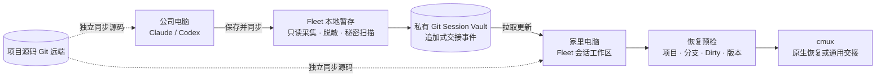

# AI 会话跨电脑同步与恢复方案

状态：产品讨论稿 v0.2（2026-07-26）<br>
适用对象：白天在公司、晚上在家，使用 Claude 和 Codex 辅助开发的个人开发者

> 这是一份可以直接进入产品评审的方案，不是对 Claude/Codex 内部目录格式的承诺。凡是供应商未公开、可能变化的能力，都必须经过本机探测，并且始终保留通用交接的兜底路径。

## 0. 产品决策摘要（先读这一页）

### 0.1 直接回答需求

| 需求 | 结论 | 产品做法 |
| --- | --- | --- |
| 把 Claude、Codex 目录提交到 Git | **可以保存，但不要直接提交原目录** | Fleet 只读采集，生成脱敏、可审阅的交接包，再写入专用私有 Session Vault |
| 换电脑 Pull 最新状态 | **可以** | 用户点击“拉取更新”，Vault 用追加式 checkpoint 合并，不覆盖任一方快照 |
| 浏览每个会话 | **可以** | 会话列表、摘要、时间线、分支/Dirty 状态和快照比较均可只读查看 |
| 管理和删除旧会话 | **应该作为核心能力** | 支持置顶、归档、移入废纸篓、恢复和批量清理；彻底清除 Git 历史是独立的高级操作 |
| 恢复会话 | **可以分级恢复** | 优先原生 resume；不兼容时生成通用 handoff，不阻塞继续工作 |
| 复制指令到 cmux | **可以，复制是第一版基线** | 先展示并复制经 shell quoting 的命令；检测到兼容 cmux 后再提供“在 cmux 中打开” |

### 0.2 推荐的优先级

```text
有合规的常开主机、网络稳定
        └─► 远程工作区（同一原生会话，最少同步问题）

两台电脑都可能离线，或不能把源码放到远端
        └─► Fleet Session Vault（默认方案）
             ├─ 通用交接包（第一版必须可靠）
             └─ 原生会话胶囊（兼容时的增强能力）

直接 Git / iCloud / Dropbox 同步 ~/.claude、~/.codex
        └─► 不作为产品方案；完整目录备份由用户在 Fleet 之外自行管理
```

核心判断是：用户需要的是“在另一台电脑继续工作”，不是把一个正在运行的进程和机器缓存搬过去。原始目录同步会把凭据、锁文件、缓存、绝对路径和版本耦合问题一起带走，短期看似省事，长期最容易丢会话或泄露秘密。

### 0.3 第一版明确不做什么

为保证实际效果和交付速度，MVP 不应承诺以下行为：

- 不递归 `git add` 任意 `~/.claude`、`~/.codex` 或整个用户目录。
- 不同步 API Key、OAuth 登录态、Cookie、SSH 私钥、Keychain 内容或 Git 凭据。
- 不在后台不断提交正在写入的 transcript；同步由用户点击“保存交接点”触发。
- 不自动切换分支、覆盖 Dirty worktree、应用未预览的 Patch 或 force push。
- 不把某个版本的 `claude`、`codex` 或 `cmux` 参数写死成永久协议。
- 第一版可以没有原生 session 导入，但必须有通用 handoff 和可复制的恢复指令。

这几个边界比“第一天就完整搬运原生会话”更重要：它们决定了功能能否在真实的公司/家庭双机环境中稳定使用。

### 0.4 本轮产品决策：MVP 默认不加密

MVP 使用“**明文但私有、严格脱敏的 Session Vault**”，不引入内容加密、恢复码或跨设备密钥迁移。这样可以保留 Git diff、全文搜索、直接浏览和故障排查能力，也显著降低两台电脑首次配置与恢复失败的概率。

这个默认值只在以下前提同时成立时适用：

- 两台电脑均由用户本人控制，磁盘与系统账号本身可信。
- Vault 使用本机仓库或用户确认的私有 Git 远端，不能是公开仓库。
- Fleet 只采集 provider 白名单数据，并在写入 Git 前执行秘密扫描和脱敏。
- 用户接受：任何有 Vault 文件或远端访问权的人都能直接阅读内容，Git 历史也可能长期保留已经删除的文本。

不满足这些前提时，Fleet 应阻止远端同步，或降级为只包含目标、决策和下一步的“轻量交接”。加密 Vault 可以作为未来的高级选项，但不进入 MVP，也不阻塞默认流程。

建议产品提供三种清晰模式：

| 模式 | 默认 | 保存范围 | 适用场景 |
| --- | --- | --- | --- |
| 私有 Vault | 是 | 结构化交接、工作区状态；原始上下文按需开启 | 本人控制的双机 + 私有远端 |
| 轻量交接 | 否 | 摘要、决策、下一步，不保存完整 transcript | 公司策略严格或只需快速接力 |
| 加密 Vault | 未来 | 与私有 Vault 相同，但内容对象加密 | 共享设备、受控密钥或合规要求场景 |

### 0.4.1 开源仓库不变量（不可绕过）

`moo-git-fleet` 是开源项目，因而“Session Vault 是另一个私有仓库”不是建议，而是硬性产品边界：

- 不允许把 Vault 放在本项目 Git 根目录、项目的 `.fleet/`、`docs/`、测试 fixture、截图、构建产物或任何会被开源仓库扫描到的路径中。
- 不允许把会话摘要、transcript、Patch、native capsule、操作日志或本机索引提交到 `moo-git-fleet` 的 Git 历史。
- 首次设置时必须比较 Vault 工作树与当前开源项目根目录；路径相同、位于其子目录，或远端与开源项目远端相同，都直接阻止初始化。
- Vault 远端必须显示为 `已验证私有` 或 `用户确认私有`。无法探测可见性时，不能把它标成安全；只能允许本机保存或轻量 handoff。
- 所有示例、测试 fixture 和文档中的会话内容都必须是合成数据，不得复制真实提示词、公司代码、内部 URL、用户名或路径。
- `.gitignore` 只能减少误操作，不能当作安全边界；开源项目还应在 pre-commit/CI 中拒绝 Vault 目录、transcript、handoff 导出物和秘密扫描命中项，并定期检查 Git 历史。

“不加密”不等于“可以把敏感信息提交到 Git”：MVP 的承诺是**敏感信息在进入任何 Git 对象之前就被排除或替换**。秘密扫描失败时默认硬阻止，不能用一个“仍然提交”的按钮静默绕过；误报例外只能保存为本机规则，不能把原文写进提交、日志或错误报告。

### 0.5 两条高频路径

面向用户的功能名建议使用「AI 会话接力」，`Session Vault` 只作为设置页和诊断信息中的技术名称。首页不要求用户理解 Commit、Push、Pull 或 checkpoint，只需要记住两个动作：

| 时机 | 用户看到的主按钮 | Fleet 做的事 |
| --- | --- | --- |
| 离开公司 | **保存并同步** | 采集摘要、检查项目状态、脱敏、秘密扫描、生成 checkpoint、Commit、Push |
| 到家开始工作 | **接着工作** | Pull、找到最新 checkpoint、映射项目路径、预检 Dirty/分支、生成 cmux 指令 |

每个主按钮内部可以展示“生成交接 → 安全扫描 → 同步”或“拉取 → 预检 → 恢复”的分步进度，但不把这些技术步骤拆成必须逐个点击的按钮。理想路径是一次主点击加一次确认。任何阻塞（未配置远端、远端隐私状态未确认、Vault 位于开源项目内、路径未映射、工作区不干净）都要出现在按钮旁边，并告诉用户下一步，而不是只弹“操作失败”。

## 1. 先给结论

建议在 Moo Fleet 中增加一个独立的「会话接力」工作区，但不要把 Claude/Codex 的原始运行目录直接当成普通 Git 仓库提交。

更稳妥、实际效果也更明显的方案是：

> **可移植交接包（Handoff Capsule） + 专用私有 Git 会话仓库（Session Vault） + Fleet GUI + cmux 恢复桥接**

每次准备换电脑时，Fleet 从本机的 Claude/Codex 目录读取会话摘要和可恢复信息，生成一个版本化、可审阅、默认明文但已脱敏的交接包，提交到专用私有会话仓库并 Push。对通过兼容性检查的会话，再额外保存一个“原生会话胶囊”（只包含该会话所需的白名单文件，而不是整个用户目录）。另一台电脑 Pull 后，Fleet 展示可恢复的会话，用户预览工作区差异，再一键生成恢复环境和 cmux 指令。

这个设计保留 Git 的可追溯性，同时避开原始 AI 运行目录里的缓存、凭据、机器绝对路径和不稳定内部格式。即使原生胶囊因版本不兼容无法导入，通用交接包仍然可以让用户继续工作。

### 1.1 三层恢复模型

不要把“同步成功”与“原生进程搬过去”混为一谈。每个会话应明确标出下面三层能力：

| 层级 | 保存内容 | 目标 | 失败时的兜底 |
| --- | --- | --- | --- |
| 工作交接 | 摘要、决策、下一步、项目状态 | 任何版本都能继续 | 始终可用 |
| 原生会话胶囊 | 适配器确认过的 session 文件片段 | 尽量保持原生上下文和 session ID | 降级为工作交接 |
| cmux 启动绑定 | cwd、provider、checkpoint、启动命令 | 一次操作打开新 workspace | 复制可审阅命令 |

因此，产品文案应说“可恢复级别：交接 / 原生 / cmux”，不要笼统显示“已同步”。

### 1.2 推荐架构



这里有两个独立同步面：项目源码继续走各项目自己的 Git 远端；AI 上下文走 Session Vault。Fleet 只在恢复预检时把两者关联起来，不把源码仓库、AI 会话仓库和本机登录状态混成一个仓库。

## 2. 需求拆解

### 2.1 真实需求不是“同步目录”

换电脑时真正需要带走的是：

1. 当前在做什么，以及下一步做什么。
2. AI 已经知道的上下文、决策和约束。
3. 对应项目的 Git 分支、提交和未提交改动。
4. 使用的是 Claude 还是 Codex、会话标题和最近活动时间。
5. 能在另一台电脑快速打开同一项目并继续工作。

而以下内容通常不值得同步，甚至不应该同步：

- API Key、OAuth Token、Cookie、SSH 私钥和 credential helper 数据。
- `node_modules`、缓存、索引、临时锁文件和机器级运行状态。
- 带有公司绝对路径、用户名或本机端口的内部数据库。
- 完整源码副本（源码本身已经由项目 Git 仓库管理）。

因此，产品应同步“可恢复的工作上下文”，而不是盲目复制“进程运行现场”。

技术上当然可以把两个目录复制到一个私有 Git 仓库，但那只能算“原始目录备份”，不能算可靠的会话同步：两个 provider 的全局配置、登录状态、缓存和机器路径会混在一起，Git 历史还会永久留下误提交的秘密。若用户确实需要完整备份，建议另做一次与 Fleet 分离的备份，并明确它不属于“会话接力”的恢复路径。

### 2.2 不能假设原生会话一定可跨机器恢复

Claude Code、Codex 以及它们未来的版本可能改变会话文件格式、会话 ID、缓存位置和启动参数。某个版本能读取的内部目录，不代表另一台电脑或下一版本仍然能读取。

Fleet 应把“原生恢复”当作增强能力，而不是唯一通道：

- **通用恢复**：用交接包生成一份结构化恢复提示词，在新终端启动一个新会话，几乎不依赖供应商内部格式。
- **原生恢复**：当探测到当前版本支持稳定的 session ID/import 参数时才显示，并标明兼容范围。

这样即使原生目录无法导入，用户仍能继续工作，不会被某个 AI 工具的内部实现锁死。

### 2.3 Git 是传输与历史，不是实时文件同步

会话仓库应采用“用户明确保存 → 生成快照 → Push”的节奏。不要让 Fleet 在 AI 正在写入 transcript 时直接对原始目录做 `git add -A`，也不要用 iCloud/Dropbox 与 Git 同时争抢同一组文件。这样可以避免半写入 JSONL、文件锁和冲突覆盖。

建议把每个交接点视为不可变事件：新交接点只新增文件，旧交接点只读保留，Git 中不提交一个由两台电脑共同改写的“当前版本”文件。Fleet 在本机根据事件关系计算最新版本。两台电脑同时从同一交接点继续时，会自然形成两个分支，界面显示“会话已分叉”，而不是用最后一次 Push 静默覆盖另一方。

这种追加式模型还有一个实际好处：Push 遇到 non-fast-forward 时，Fleet 可以先 Fetch/Rebase；因为两台设备通常新增的是不同路径下的事件文件，Git 能自动合并，只有业务上同一会话发生分叉时才需要用户决定，而不是让用户处理 JSON 冲突标记。

### 2.4 如果有常开主机，远程工作区可能更简单

还可以考虑另一条路线：把代码和 Claude/Codex 会话始终运行在一台受信任、可远程访问的主机（例如家里的 Mac mini、开发服务器或公司允许的远程工作区）上，两台电脑只通过 cmux 的 SSH workspace 或 provider 的 remote-control 连接。

它的优点是不会搬运原生 session 文件、不会做路径映射，也不会把对话写进 Git；看到的就是同一个正在运行的会话。缺点是需要主机持续在线、网络稳定，并且必须符合公司源代码和账号策略。

因此可以用下面的决策规则：

| 条件 | 推荐方案 |
| --- | --- |
| 有合规的常开主机，且经常在线 | 远程工作区优先，Fleet 管理连接和书签 |
| 两台电脑都可能离线，或不能把源码放到远端 | Fleet Session Vault + 通用交接 |
| 只想带走下一步和少量上下文 | 仅保存轻量 handoff，不保存完整 transcript |

这也是为什么 Session Vault 应作为本地优先的第二条路径，而不是假设所有用户都必须同步完整 AI 目录。

### 2.5 交接摘要不能完全依赖猜测

“把最近几百条消息拼起来”不等于可靠的交接。不同 provider 的 transcript 结构和工具输出差异很大，Fleet 也不应该擅自替用户总结出一个看似正确、实际过时的下一步。建议按下面的优先级生成摘要：

1. **Provider 结构化导出**：适配器能读到明确的标题、最近目标和 checkpoint 时优先使用。
2. **标准交接提示**：会话仍在运行时，Fleet 提供“生成交接摘要”按钮，把统一模板交给当前 Claude/Codex，请它输出目标、已完成、决策、下一步、阻塞和风险。
3. **本地启发式 + 用户编辑**：会话已退出或 provider 不支持导出时，从最近消息和 Git 状态生成草稿，用户在提交前确认/修改。

无论来源如何，提交前都应显示一个可编辑的预览，而不是把摘要悄悄写进远端。建议的最小字段如下：

```yaml
goal: ""
completed: []
decisions: []
nextSteps: []
blockers: []
commands: []
risks: []
source: provider-export | ai-generated | heuristic | manual
reviewedAt: ""
```

这样即使 Claude/Codex 的本地格式改变，用户仍能用同一套交接模板继续工作；同时 UI 可以明确标注“已由用户确认”或“仍是自动草稿”，避免把低置信度内容伪装成事实。

## 3. 推荐的产品形态

### 3.1 Fleet 中新增「会话接力」入口

顶层导航新增一个轻量的「会话接力」工作区，与现有仓库工作台并列。首次进入时用向导完成：

1. 选择要监控的 Claude、Codex 会话目录（也支持手动添加目录）。
2. 选择专用会话仓库的位置和远端。
3. 设置本机名称，例如“公司 Mac”“家里 Mac”。
4. 检查远端是否为私有，确认数据分类、保留期限和“明文存储在私有 Git”提示。
5. 为本机项目设置路径别名，例如 `moo-fleet` 对应公司和家里的不同绝对路径。

之后的日常流程应控制在两个主要动作内：

- **准备离开**：选择会话 →「保存并同步」。
- **开始工作**：点击「接着工作」→选择会话 →确认恢复预检；cmux 可用时直接打开，不可用时复制指令。

Commit、Push、Pull、秘密扫描和 checkpoint 仍应显示在可展开的进度详情与操作记录中，方便诊断，但不占据高频路径的按钮层级。

### 3.2 会话列表应该回答三个问题

列表不要只显示文件名，而要让用户一眼知道：

| 信息 | 示例 | 用途 |
| --- | --- | --- |
| AI 工具 | Claude / Codex | 区分恢复方式 |
| 会话标题 | 重构分支切换流程 | 快速识别工作 |
| 项目与分支 | Moo Fleet · `feature/session-sync` | 确认恢复目标 |
| 来源设备 | 公司 Mac | 判断最新来源 |
| 最后交接 | 18:42 · 12 分钟前 | 判断是否需要 Pull |
| 工作区状态 | clean / 3 个未提交文件 | 避免覆盖本地改动 |
| 同步状态 | 已同步 / 有新版本 / 冲突 | 直接决定下一步 |

默认排序按“最近交接时间”，并提供「我的待处理」「有新版本」「有冲突」「全部」筛选。

Claude 和 Codex 的会话应保持为两个可独立恢复的对象，不要为了“统一”而把两份 transcript 串成一条对话。可以提供一个可选的“工作项”分组，把同一项目/分支下的 Claude 会话、Codex 会话和 Git checkpoint 放在一起；分组只是导航关系，不改变各 provider 的恢复边界。

### 3.3 会话详情页

详情页建议分成四个区块：

- **摘要**：当前目标、已完成事项、下一步、阻塞点。
- **上下文时间线**：关键用户指令、AI 决策、重要命令和最近交接记录。
- **工作区**：项目路径映射、分支、HEAD、未提交文件、待应用 Patch。
- **恢复**：兼容性检查、恢复预览、启动方式和「复制 cmux 指令」。

高风险动作（应用 Patch、覆盖本地交接点、删除远端快照）必须显示变更预览，不做静默覆盖。

### 3.4 让“浏览”和“恢复”成为两个独立动作

用户通常先想确认“这是不是我昨晚做到一半的会话”，不一定马上要启动它。因此列表中的「查看」不应隐含恢复：

- **浏览**：以虚拟滚动时间线显示用户指令、AI 结论、工具调用摘要和交接点；敏感片段显示为已脱敏标记，原始内容只在已配置的本机权限范围内读取。
- **比较**：选择两个快照，查看目标、分支、未提交文件、Patch 和上下文变化。
- **恢复**：通过路径、分支、脏工作区和 provider 版本检查后，才显示主按钮。
- **复制**：单独复制恢复提示词或 cmux 命令，复制前展示命令预览，不把 Token 或完整对话写进命令行。

这样“浏览会话”不会误触覆盖工作区，“恢复会话”也不会迫使用户先读完整 transcript。

### 3.5 推荐的桌面首屏

会话页的首屏应围绕“现在要不要交接/恢复”组织，而不是先让用户理解仓库内部结构。1024px 宽度下使用“筛选栏 + 列表 + 可关闭详情抽屉”，1440px 及以上再把详情抽屉固定在右侧。

```text
┌ 会话 ─────────────────────────────────────────────────────────────┐
│ 公司 Mac · Vault 已同步  │  [保存交接] [拉取更新]  [设置]          │
│ [待处理] [有新版本] [冲突]   搜索会话 / 项目…                      │
├───────────────────────────────────────────────────────────────────┤
│ ● Claude  重构分支切换流程                         有新版本        │
│   Moo Fleet · feature/session-sync · 公司 Mac · 18:42              │
│   下一步：补恢复预检       3 个未提交文件 · 通用恢复可用            │
│   [查看] [保存交接] [恢复]                                           │
│                                                                   │
│ ● Codex   批量 Pull 回归                          已同步 · 10:12   │
│   moo-git-fleet · master · 家里 Mac                               │
│   工作区 clean · 原生恢复不可用（可用通用 handoff）                │
└───────────────────────────────────────────────────────────────────┘
```

首屏的几个 UX 约束：

- “查看”永远是只读动作；不会启动 AI、改写 provider 目录或修改项目工作区。
- “恢复”先打开预检抽屉，再由用户确认；按钮旁直接显示路径、分支、Dirty 和 Patch 风险。
- “复制 cmux 指令”是独立动作，不把复制命令和应用 Patch 绑在一起。
- 状态使用图标、文字、来源设备和时间共同表达；颜色只能辅助，不能单独承载“冲突/失败”。
- 会话列表支持上下键、Enter 查看、Esc 关闭抽屉；关闭后焦点回到触发按钮。

### 3.6 状态机要让用户看懂

Fleet 内部可以用更细的状态，但界面只呈现下面这组可行动状态：

| 状态 | 用户含义 | 主动作 |
| --- | --- | --- |
| 本机草稿 | 已保存到本机，远端还没有 | 同步到远端 |
| 已同步 | 本机与 Vault 一致 | 查看 / 保存新交接 |
| 远端有新版本 | 另一台电脑有新的 checkpoint | 拉取并查看 |
| 需要路径映射 | 找不到本机项目目录 | 选择目录 |
| 需要预检 | 分支、Dirty 或 Patch 尚未确认 | 查看恢复预检 |
| 已分叉 | 两台电脑从同一 checkpoint 各自继续 | 选择分支 / 合并为新交接 |
| 已降级 | 原生恢复不兼容，但通用 handoff 可用 | 复制通用恢复指令 |
| 同步失败 | 数据仍保存在本机，尚未 Push | 重试同步 |

不要把“已同步”当成“可原生恢复”。列表应该另外显示能力标签：`通用交接`、`原生恢复`、`cmux 可打开`，这样用户不会把 Git Push 成功误解为进程已经跨机器搬运成功。

### 3.7 会话管理：归档、删除与保留策略

“查看”解决的是找回上下文，“管理”解决的是让 Vault 长期可用。会话列表必须提供独立的生命周期操作，而不是只会不断累积 checkpoint：

| 操作 | 默认结果 | 可否恢复 | 是否影响 provider 原始目录 |
| --- | --- | --- | --- |
| 置顶 | 标记为重要，清理时跳过 | 是 | 否 |
| 归档 | 从“活跃”列表隐藏，内容仍可搜索和恢复 | 是 | 否 |
| 移入废纸篓 | 写入同步的删除标记，在所有设备隐藏 | 建议保留 30 天 | 否 |
| 清空废纸篓 | 从当前 Vault 工作树移除未引用对象；Git 对象库和远端历史未必缩小 | 仅靠 Git 历史/备份，不能承诺一键恢复 | 否 |
| 清理 Git 历史 | 重写远端历史，尝试从仓库对象中彻底移除 | 否 | 否 |

MVP 至少实现前四项；“清理 Git 历史”属于危险的高级工具，不能伪装成普通删除。因为本方案默认不加密，删除确认必须明确写出：**从列表删除不等于从 Git 历史抹除**。若曾误提交凭据或其他敏感信息，应立即轮换凭据，并按远端平台流程执行历史清理；Fleet 可以提供检查清单，但不应在没有额外确认和备份的情况下自动 force-push。

建议的管理体验：

- 默认只显示“活跃”会话，提供「已归档」「废纸篓」「全部」筛选，并支持按项目、provider、设备、最后交接时间和占用空间过滤。
- 提供“建议清理”视图：默认标记超过 90 天没有新 checkpoint、没有置顶、没有未同步内容且没有活跃子分支的会话；只提出建议，不自动删除。
- 批量操作先展示数量、总大小、最后活动时间、关联分叉和恢复能力，再让用户确认。存在本机待 Push、远端冲突或其他设备未 Pull 时，禁止直接清空。
- 删除一个会话只改变 Session Vault 的生命周期状态，不删除 `~/.claude`、`~/.codex` 原始会话，不删除项目源码，也不删除 cmux workspace；这几个范围必须在确认框中分开显示。
- 删除事件本身也要进入 Vault 的生命周期日志，确保另一台旧电脑 Pull 后不会把已删除会话重新显示出来。旧设备若继续从已删除会话创建 checkpoint，应显示“已删除会话产生新内容”，要求用户显式恢复或另存为新会话。
- 如需释放本机 provider 目录空间，可另设“清理本机来源”流程：先按 provider、大小和最后访问时间预览，再逐设备明确确认；它不随 Vault 删除事件同步，也不能默认删除供应商原始文件。

## 4. 数据结构：追加式交接事件，不同步原始目录

建议会话仓库采用如下结构：

```text
session-vault/
├── vault.yaml                    # 仓库版本、隐私模式、保留策略、schema 版本
├── events/                       # 只追加，不原地改写旧事件
│   ├── company-mac/
│   │   └── <ulid>.json           # checkpoint 与生命周期事件的脱敏元数据
│   └── home-mac/
│       └── <ulid>.json
├── objects/                      # 事件引用的脱敏交接内容（MVP 明文）
│   └── <checkpoint-id>/
│       ├── handoff.md             # 人类可读交接摘要
│       ├── workspace.json        # 项目、分支、commit，不含本机绝对路径
│       ├── transcript.ndjson     # 可选：当前 checkpoint 的增量上下文
│       ├── changes.patch         # 可选：未提交改动，不含源码快照
│       └── native/               # 可选：适配器白名单文件
│           ├── manifest.json
│           └── files/...
```

本机搜索索引、绝对路径映射和临时预览缓存放在 Fleet 自己的数据目录，例如 `.fleet/index.sqlite` 对应的应用数据区，不提交到 Vault。这样换电脑只需要重新建立一次路径映射，也不会把公司或家庭电脑的目录结构写进 Git 历史。Vault 目录本身必须位于开源项目之外，并在初始化时做路径和远端隔离检查。

### 4.1 交接事件的最小字段

```json
{
  "schemaVersion": 1,
  "eventType": "checkpoint",
  "eventId": "01K123...",
  "checkpointId": "checkpoint-content-id",
  "parentCheckpointIds": ["previous-checkpoint-id"],
  "sessionId": "stable-id",
  "provider": "claude",
  "providerSessionId": "local-only-or-redacted",
  "title": "重构分支切换流程",
  "projectId": "moo-git-fleet",
  "branch": "feature/session-sync",
  "head": "abc1234",
  "machine": "company-mac",
  "createdAt": "2026-07-26T09:00:00Z",
  "updatedAt": "2026-07-26T10:42:00Z",
  "lastCheckpoint": "2026-07-26T10:42:00Z",
  "payloadPath": "objects/checkpoint-content-id",
  "capabilities": {
    "nativeResume": false,
    "universalHandoff": true,
    "patchAvailable": true
  }
}
```

`parentCheckpointIds` 用于判断会话是正常前进还是从同一个交接点分叉；`providerSessionId` 只有在确认不会泄露敏感信息且对恢复有帮助时才保存，否则只保留本机映射。完整对话、提示词、Patch 和 native capsule 只有在通过白名单与秘密扫描后，才可以按用户选择写入私有 Vault；MVP 不对它们加密，因此任何进入对象目录的内容都必须被视为 Vault 访问者可读的明文。

生命周期事件使用同一个追加式事件流，例如：

```json
{
  "schemaVersion": 1,
  "eventType": "lifecycle",
  "eventId": "01K124...",
  "sessionId": "stable-id",
  "action": "trash",
  "machine": "company-mac",
  "createdAt": "2026-07-26T18:45:00Z",
  "retentionUntil": "2026-08-25T18:45:00Z",
  "reason": "用户手动清理"
}
```

索引根据所有事件计算 `active`、`archived`、`trashed`、`restored` 等状态，不原地改写旧 checkpoint。这样删除标记可以跨设备同步，也能解释“为什么这个会话不再出现在列表中”。

事件引用的 native manifest 还应记录原生胶囊状态，避免把“有 session ID”误认为“一定能恢复”：

```json
{
  "nativeCapsule": {
    "status": "verified",
    "providerVersion": "detected-at-capture",
    "formatVersion": "adapter-format-or-unknown",
    "files": [
      { "path": "files/session-record", "sha256": "...", "bytes": 12345 }
    ],
    "restoreCheck": "passed"
  }
}
```

`status` 至少区分 `verified`、`unsupported`、`not-captured`、`restore-failed`。原生胶囊只由 provider adapter 生成，不允许 UI 递归打包整个 `~/.claude` 或 `~/.codex`。

### 4.2 项目身份不能依赖绝对路径

公司和家里的项目路径很可能不同，不能把 `/path/to/project` 之类的绝对路径直接当作会话身份。建议用以下信息组合生成稳定 `projectId`：

- Git 根目录的规范化远端 URL（去除内嵌凭据）。
- 主远端名称和仓库名。
- 在没有远端时使用用户确认的本地项目标识。

每台电脑只保存本地映射：

```yaml
projectMappings:
  moo-git-fleet:
    localPath: /path/to/moo-git-fleet
    trustedRoot: dev
```

恢复前若找不到映射，GUI 只要求用户选择一次本地目录，之后复用该映射。

### 4.3 原生胶囊的捕获与还原边界

原生胶囊不是把文件“原地覆盖”到另一台电脑。安全流程应是：

1. 适配器读取当前 CLI 版本、会话格式和该会话的最小依赖文件。
2. 只复制白名单相对路径，去掉绝对路径、凭据和机器级配置，并记录 checksum。
3. 在 Vault 的临时 staging 目录写入已脱敏的明文对象，并在写入前后校验路径和大小。
4. 目标电脑运行 dry-run，确认 provider 版本、项目身份和 session ID 可接受。
5. 用户确认后，适配器备份本机对应文件，再写入 native store；任何一步失败都保留通用交接路径。

如果供应商没有稳定的导入接口，第一版可以只做“原生胶囊导出 + 可选还原”，不把它作为验收必需项。这样不会因为一次 CLI 升级阻塞跨电脑交接。

### 4.4 增量与容量策略

完整 transcript 可能包含大量工具输出和重复上下文。建议：

- 交接包按 checkpoint 保存新增段，而不是每次重新写入整份 transcript。
- 默认保留交接摘要和结构化消息索引；完整用户/助手消息按用户选择增量保存，超大工具输出只保留摘要和本地引用，并在 UI 标出“未同步原始输出”。
- 单个快照超过可配置上限（例如 50 MB）时先显示估算大小和排除选项，再允许提交。
- 过期快照采用“归档”策略；Git 历史清理必须是显式的高级操作。

### 4.5 Git 的安全边界（必须写进实现验收）

Fleet 的 Git 工作目录和 provider 原始目录必须是两个完全不同的路径。实现上建议把 Vault 放在应用数据目录或用户明确选择的独立目录中，例如：

```text
~/Library/Application Support/Moo Fleet/
└── session-vault/
    ├── staging/       # 每次捕获的临时目录，完成后清空
    ├── repo/          # 专用 Git working tree；不是项目源码仓库
    └── index.sqlite   # 本机索引，不进入 Git

~/.claude/             # 仅作为只读采集源，不是 Git worktree
~/.codex/              # 仅作为只读采集源，不是 Git worktree
```

一次“保存交接点”的真实顺序应当是：

```text
读取（只读）
  → 生成通用摘要 / workspace 状态
  → 选择性读取 transcript 增量
  → 秘密扫描（失败即停止）
  → 写入 staging 并执行最终秘密扫描
  → 原子 rename 到 objects/
  → 生成 append-only event
  → Git commit
  → 用户确认后 Push
```

任何步骤失败，都要保留本机 checkpoint，并把状态标成“仅本机保存”。不要出现“UI 显示已同步，但 Git commit 尚未落盘”或“Push 失败后删掉待同步数据”的情况。测试应明确断言：即使进程在序列化、秘密扫描、Commit 或 Push 的任意阶段被终止，下一次启动也能发现并继续处理未完成的本机 checkpoint。

### 4.6 内容分层能显著降低容量和隐私风险

不要每次都把完整 transcript 重新提交。建议将 checkpoint 分成三个可独立开关的层：

| 层 | 默认 | 说明 |
| --- | --- | --- |
| 交接摘要 | 开启 | 目标、已完成、下一步、阻塞、关键决策；用于首屏和通用恢复 |
| 结构化工作区 | 开启 | projectId、分支、HEAD、Dirty 统计、选中的 Patch |
| 原始上下文 | 关闭或按需 | 用户/助手消息和工具输出；按增量保存，默认不写入，可设置大小上限 |

这样用户即使关闭“原始上下文同步”，也仍然拥有足够可靠的交接结果。列表和搜索只依赖脱敏 manifest；只有打开时间线或执行恢复时才按需加载大对象。

## 5. Git 与隐私策略

### 5.1 专用会话仓库，而不是项目仓库

会话仓库必须与源码仓库分离，尤其不能使用开源的 `moo-git-fleet` 仓库作为 Vault：

- 会话内容可能包含跨项目上下文、公司代码、内部链接或个人信息，不适合进入开源项目的提交历史。
- 项目仓库的协作者不一定应该看到个人 AI 对话；源码仓库的公开性也不能由 Fleet 猜测。
- 一个会话可以关联多个项目或多个 Worktree，应该由独立 Vault 统一管理。
- Vault 可以放在应用数据目录中的独立 Git worktree，或用户明确选择的独立仓库；初始化时必须检查路径、远端 URL 和仓库可见性。

首次版本可以使用用户自己的私有 Git 远端（自建、公司 Git、GitHub/Gitee 私有仓库均可），但 Fleet 不保存远端密码，继续使用系统 SSH Agent、Keychain 或 credential helper。这里的 Keychain 只用于 Git 登录凭据，不用于保存会话加密密钥；MVP 根本不生成会话加密密钥。

### 5.2 MVP 默认不加密：先把敏感内容挡在 Git 之外

默认保存的是“明文但私有”的对象，便于 Git diff、搜索、浏览和修复。这个选择不降低脱敏要求，反而要求更严格的写入前边界：

1. **远端可见性检查**：状态分为 `已验证私有`、`用户确认私有`、`未验证`、`公开/不安全`。只有前两者允许同步完整 Vault；后两者只能本机保存或使用轻量 handoff。无法通过平台 API 探测时，用户必须明确确认远端归属和可见范围，且 UI 持续显示“私有但未由 Fleet 验证”。
2. **采集白名单**：只读取 provider adapter 选出的会话字段，不递归提交 `~/.claude`、`~/.codex` 或整个用户目录；不采集 API Key、OAuth 登录态、Cookie、SSH 私钥、Keychain 内容、Git 凭据、`.env` 和 credential helper 数据。
3. **秘密扫描硬门槛**：扫描摘要、用户/助手消息、工具输出、Patch、native 文件、文件名和恢复命令。命中疑似秘密时停止 commit，给出本机可定位的类型和位置；日志只保留哈希、类型和行号，不复制原文。脱敏后用稳定的 `[REDACTED:<type>]` 占位符重新预览，不能静默放行。
4. **敏感内容分级**：摘要和工作区状态默认同步；原始 transcript、工具输出和 Patch 默认关闭或逐次确认。公司源代码片段、内部 URL、个人数据即使没有明显 token，也必须标记为敏感，只允许进入已确认私有 Vault，或改用轻量 handoff。
5. **用户确认**：首次启用完整 Vault 时显示“内容以明文保存于私有 Git，Git 历史会保留过去版本”的一次性确认；之后在同步按钮旁保持紧凑的隐私状态，不重复打断正常操作。

建议把分类直接写入 checkpoint manifest，避免“秘密扫描没命中”被误解为“内容公开无风险”：

| 分类 | 示例 | `moo-git-fleet` 开源仓库 | 私有 Session Vault | 默认动作 |
| --- | --- | --- | --- | --- |
| C0 公共元数据 | provider、用户确认的标题、时间、状态 | 永不写入运行数据 | 可写 | 同步 |
| C1 脱敏交接 | 目标、决策、下一步、分支和统计 | 永不写入运行数据 | 可写 | 默认同步 |
| C2 敏感上下文 | 公司代码片段、内部 URL、个人信息、原始工具输出 | **禁止** | 仅显式确认后可写 | 默认排除或改用轻量 handoff |
| C3 凭据/秘密 | API Key、Token、Cookie、私钥、密码、`.env` | **禁止** | **禁止** | 永久阻止并提示处置 |

这里的“永不写入运行数据”表示开源源码仓库不接收任何真实 Session Vault 产物；文档和测试只能使用合成样例。即使 C0/C1 本身不敏感，也应写入独立私有 Vault，而不是借用开源项目的 Git 历史。

如果未来需要加密，`加密 Vault` 应作为独立模式设计密钥注册、恢复、轮换和迁移；它是增强项，不应在 MVP 文档或验收中作为前置条件。

### 5.3 提交模型

- 本机可自动保存未提交的临时 checkpoint，保存在 Fleet 应用数据目录，不推送。
- 只有用户点击「同步到会话仓库」且远端隐私门槛通过后，才生成 Git commit 和 Push。
- 每次同步新增一个不可变事件和一组已脱敏的明文对象；不直接重写旧快照，也不提交共享的“当前版本”指针。
- Fleet Pull 后在本机重建会话索引，并根据父 checkpoint 关系计算每个会话的一个或多个最新 head。
- Push 被远端新提交拒绝时，Fleet 自动 Fetch/Rebase 后重试；若只是不同设备新增事件，不要求用户处理 Git 冲突。
- Push 失败时保留本地待同步状态，并明确显示“已保存到本机，尚未到远端”。
- 两台电脑同时编辑同一会话时，不覆盖任何一方，生成“会话已分叉”状态并允许“继续其中一条”“合并为新交接点”“拆成两个会话”。

“最新”不能只按两台电脑的本地时间排序。Fleet 应以 checkpoint 的父子关系、Vault Git 提交和设备来源共同判断；设备时钟漂移时仍保留两条事件，并在 UI 写出“根据远端历史判断”或“时间仅供参考”。这样用户看到的“最新”是可解释的历史结果，而不是最后一次上传恰好覆盖了另一台电脑。

### 5.4 删除、垃圾回收与 Git 历史

- 归档、移入废纸篓、恢复都写成追加式生命周期事件；索引在 Pull 后按事件顺序重建，删除状态不会因旧设备重新扫描而复活。
- 清空废纸篓前，Fleet 计算仍被活跃 checkpoint 引用的对象，只移除当前工作树中不再引用且已过保留期的对象；删除操作本身仍会留下 Git commit，`.git/objects` 与远端占用不会因此自动减少。
- 普通删除不承诺抹除 Git 历史。UI 必须同时显示“当前 Vault 已隐藏/移除”和“历史版本仍可能存在”两条结果。
- “从 Git 历史清理”需要单独的高级流程：先列出受影响的 commit、要求用户备份并确认所有设备已停止 Push，再由用户选择是否执行历史重写；MVP 可以只提供操作指引和检查清单。
- 如果一台设备在收到 `trash` 事件后继续产生 checkpoint，Pull 时标为“删除与新内容冲突”，不能自动删除新内容，也不能静默恢复旧会话。

### 5.5 误提交敏感信息的处置

若扫描漏报或用户误操作导致敏感信息进入任何 Git commit，Fleet 应立即停止后续 Push，并显示一份不含原文的处置清单：撤销/轮换凭据、记录受影响的远端和 commit、隔离本地 Vault、联系远端管理员并按平台流程清理历史。删除工作树文件不是补救措施；在确认历史清理完成前，界面应持续显示“可能已暴露”。

## 6. 恢复流程

### 6.1 通用恢复（第一版必须支持）

1. 在家里电脑点击「拉取更新」。
2. 选择会话，查看摘要、分支和最近快照。
3. Fleet 检查本地项目是否存在、HEAD 是否匹配、工作区是否干净。
4. 若有未提交 Patch，显示文件列表和 diff 预览；用户确认后才应用。
5. 生成 `handoff.md` 和结构化上下文文件。
6. 根据当前工具生成启动命令或恢复提示词。
7. 用户点击「复制 cmux 指令」，粘贴执行，打开一个新的 cmux pane/window。

通用恢复不依赖供应商的 session ID。即便 Claude/Codex 内部格式升级，用户仍能看到完整摘要和关键上下文，并继续新会话。

### 6.2 原生恢复（可选增强）

Fleet 启动时探测本机 CLI 版本和能力，例如：

- 是否支持 `resume` / `continue` / `import`。
- 是否能通过稳定 ID 读取会话。
- 当前会话格式的 schema 或版本。

只有探测通过时才显示“原生恢复”。按钮文案应包含兼容提示，例如“Claude 原生恢复（当前版本支持）”。探测失败时不把用户挡在流程外，而是自动退回通用恢复。

### 6.3 cmux 桥接

不要让 Fleet 直接注入正在运行的终端进程；更安全的设计是生成可审阅的命令：

```text
打开 cmux → 新建窗口 → 进入项目目录 → 检查分支 → 启动 Claude/Codex → 载入 handoff.md
```

GUI 提供三个动作：

-「复制恢复指令」：复制当前 shell 可执行的一整段命令。
-「复制恢复提示词」：只复制给 AI 的上下文，不包含 shell 命令。
-「在 cmux 中打开」（可选）：检测到 cmux CLI 后，经用户确认调用；未安装时退回复制。

命令模板应由 provider adapter 生成，并允许用户在设置中编辑。不要把某个版本的 cmux 参数硬编码成不可修改的协议。

### 6.4 当前 CLI 能力下的命令生成

Fleet 不需要猜测某个会话的 ID 是否能用；启动时可以执行本机 CLI 的 `--help`/版本探测，并把结果写入能力缓存。以当前常见命令形态为例，适配器可以生成下面这类**示意命令**（实际输出必须做 shell quoting，并由用户在 GUI 中确认）：

```sh
# Claude：原生恢复
cd "/path/to/project" && claude --resume "<claude-session-id>"

# Codex：原生恢复
codex -C "/path/to/project" resume "<codex-session-id>"

# 通用恢复：从本地交接提示词启动新会话
cd "/path/to/project" && claude "$(cat .fleet/handoffs/<stable-id>/resume-prompt.txt)"

# cmux：新建 workspace 并启动命令
cmux new-workspace \
  --name "Moo Fleet · 重构分支切换流程" \
  --cwd "/path/to/project" \
  --command 'codex -C "/path/to/project" resume "<codex-session-id>"'
```

如果目标 cmux surface 已经存在，Fleet 还可以登记可检查的恢复绑定，而不是把命令藏在应用内部：

```sh
cmux surface resume set \
  --kind agent \
  --checkpoint "<provider-session-id>" \
  --cwd "/path/to/project" \
  --source moo-fleet -- \
  codex -C "/path/to/project" resume "<provider-session-id>"
```

这类绑定应是可选增强。cmux 不可用、版本不支持或用户不希望 Fleet 直接调用时，仍提供“复制命令”和“复制提示词”。命令中不得内嵌 API Key、完整 transcript 或未审阅的用户输入；长文本应写到本地临时文件后引用。

本稿写作时的本机探测结果（仅作为适配器测试样本，不应硬编码为永久协议）包括：Claude 支持 `--resume`/`--continue`/`--fork-session`，Codex 支持 `resume`/`fork`/`--last`，cmux 支持 `new-workspace --cwd --command` 与 `surface resume set --checkpoint`。Fleet 每次启动仍应重新探测版本和帮助文本。

## 7. Provider Adapter 设计

为避免把 Claude/Codex 逻辑散落在 UI，服务端定义统一适配器接口：

```ts
interface SessionProviderAdapter {
  id: 'claude' | 'codex' | string;
  discover(input: DiscoveryInput): Promise<DiscoveredSession[]>;
  readCheckpoint(session: DiscoveredSession): Promise<SessionCheckpoint>;
  redact(checkpoint: SessionCheckpoint): Promise<SanitizedCheckpoint>;
  capabilities(): Promise<ProviderCapabilities>;
  captureNative?(session: DiscoveredSession): Promise<NativeCapsule | null>;
  restoreNative?(input: NativeRestoreInput): Promise<NativeRestoreResult>;
  buildResumeCommand(input: ResumeCommandInput): Promise<ResumeCommand>;
}
```

适配器只负责“发现、读取、脱敏、捕获/还原白名单文件、生成恢复命令”，不负责任意修改供应商原始目录。还原时必须先备份、dry-run，再在用户确认后写入。这样可以：

- 在 Claude/Codex 更新格式时单独升级适配器。
- 用 fixture 测试，不需要把真实用户目录提交到测试环境。
- 将来增加 Cursor、Aider 或其他 CLI，而不改会话核心模型。

发现器还应记录来源版本、最后扫描时间和读取失败原因。读不到某一份旧会话时，列表显示“需要升级适配器”，而不是静默消失。

### 7.1 Fleet 内部边界建议

会话能力应与现有 Repository 服务分开，避免把 provider 的特殊文件混进普通仓库扫描：

| 服务 | 责任 |
| --- | --- |
| `SessionDiscoveryService` | 只读发现 Claude/Codex 会话，输出统一的 `DiscoveredSession` |
| `SessionVaultService` | 打包、脱敏、秘密扫描、快照、生命周期、Git fetch/commit/push 和冲突状态 |
| `SessionRestoreService` | 路径/分支/Dirty 检查、Patch 预览、native dry-run 与回退 |
| `CmuxBridge` | 检测 cmux、生成 shell-safe 命令、可选创建 workspace/绑定 checkpoint |
| `SessionIndex` | 从脱敏 manifest 和本机缓存生成搜索/筛选结果 |

客户端只接收已脱敏的摘要、状态和恢复计划；原始 transcript、native 文件和 provider 原始目录操作留在本机服务端。第一版可以先提供本地 API，后续再把 Vault 远端和 provider adapter 独立升级。无论前端还是服务端日志，都不得把敏感原文写入开源项目工作树。

可供实现讨论的 API 形态（不是当前接口承诺）如下：

```text
GET  /api/sessions
POST /api/sessions/:id/checkpoints
POST /api/session-vault/pull
POST /api/sessions/:id/restore/plan
POST /api/sessions/:id/restore/execute
POST /api/sessions/:id/cmux-command
POST /api/sessions/:id/archive
POST /api/sessions/:id/trash
POST /api/sessions/:id/restore-lifecycle
POST /api/session-vault/gc/plan
POST /api/session-vault/gc/execute
```

`restore/plan` 应是纯只读且可重复调用；只有 `restore/execute` 才能应用 Patch、写入 native store 或请求 cmux 创建 workspace。

## 8. GUI 交互草案

### 会话列表行

```text
┌ Claude  重构分支切换流程 ─────────────── 有新版本 ┐
│ Moo Fleet · feature/session-sync · 公司 Mac       │
│ 18:42  | 3 个未提交文件 | 通用恢复可用            │
│ [查看] [保存交接点] [恢复]                         │
└───────────────────────────────────────────────────┘
```

### 恢复确认卡

恢复前用一张卡片集中显示：

- 本地项目路径映射结果。
- 本地分支与快照分支是否一致。
- 是否存在本地未提交改动。
- Patch 将新增、修改、删除哪些文件。
- 原生恢复是否可用，以及回退到通用恢复的原因。
- 将要复制/执行的 cmux 命令（可展开查看）。

按钮层级建议：主按钮是「恢复到本机」，次按钮是「复制 cmux 指令」，危险动作单独放在「更多」菜单中。

### 清晰的同步状态

不要只用颜色表示状态，统一使用“图标 + 文案 + 时间”：

- 已同步 · 10:42
- 本机有待同步交接点
- 远端有新版本 · 来自家里 Mac
- 两台电脑都改过 · 需要选择
- 仅本机保存 · 尚未 Push

### 会话管理栏

列表顶部应有一个不打扰高频接力的「管理」入口，进入后显示容量和生命周期，而不是把危险的删除按钮放在每一行：

- `活跃 / 已归档 / 废纸篓 / 全部` 四个筛选，默认进入“活跃”。
- 每行支持「置顶」「归档」「移入废纸篓」；批量选择后提供“建议清理”和“移入废纸篓”。
- 废纸篓中显示剩余保留天数、原始大小、最后 checkpoint 和“恢复”按钮；清空前展示将移除的对象数量及“Git 历史仍可能保留”的警告。
- “从 Git 历史清理”不放在普通菜单中，放在 Vault 设置的高级区域，并要求输入明确的确认短语；MVP 可以只提供人工操作指引。
- 搜索结果和恢复预检默认排除废纸篓，用户主动选择“全部”才可查看。删除/归档操作完成后用状态条反馈，支持撤销最近一次归档或移入废纸篓。

### 8.1 推荐的最短操作路径

把高频操作固定在页面顶部，详情页只在需要时展开高级选项：

| 场景 | 用户操作 | Fleet 反馈 |
| --- | --- | --- |
| 下班前 | 勾选会话 → `保存并同步` | 显示扫描、脱敏、提交、Push 的逐项结果 |
| 到家后 | `接着工作` | 自动 Pull，并按项目/分支筛出待处理会话 |
| 开始工作 | 选择会话 → 确认路径与 Dirty 状态 | 应用安全范围内的 Patch，生成 cmux workspace |
| 只想查历史 | `查看` | 不改变本地项目，不启动 AI，不触碰原始 session 文件 |

理想路径是一次主点击加一次确认；网络失败、远端隐私未确认、Vault 位于开源项目内、路径未映射或工作区不干净时，界面应把阻塞原因放在按钮旁边，而不是只弹一个“操作失败”。

### 8.2 首次设置与空状态

首次设置采用四步向导，但只要求完成当前必要步骤：

1. 选择 provider 目录并执行只读扫描。
2. 选择或初始化私有 Session Vault。
3. 验证 Vault 不在开源项目内，确认远端可见性、数据分类和保留期限。
4. 设置设备名和项目路径映射，并运行一次“生成本地交接点”预览，确认脱敏结果。

没有配置远端或无法验证私有性时，仍允许先在本机浏览和生成轻量交接点；空状态明确写出“已保存到本机，尚未同步”，不要把“未配置”伪装成错误，也不能让用户误以为完整 Vault 已经可同步。

### 8.3 面向桌面的布局建议

会话页不需要再造一个复杂 IDE：

- **1024px 左右**：左侧只保留筛选栏，中间为会话列表；详情和恢复确认采用可关闭的右侧抽屉，避免三栏挤压。
- **1440px 及以上**：左侧筛选、中间列表、右侧详情三栏常驻；右侧底部固定主要动作「保存交接点」「恢复到本机」。
- 所有状态同时使用图标、文字和时间；颜色只作为辅助，失败/冲突不能只靠红色表达。
- 列表支持键盘上下移动、Enter 查看、快捷键复制恢复命令；恢复抽屉打开后焦点回到触发按钮。
- transcript 使用虚拟滚动和按需加载，首次打开先显示摘要，避免大文件让界面卡顿。

## 9. 与“直接提交 AI 目录”方案的比较

| 方案 | 上手成本 | 跨版本稳定性 | 隐私风险 | 冲突处理 | 建议 |
| --- | --- | --- | --- | --- | --- |
| 原始 Claude/Codex 目录直接 Git | 低 | 低 | 高 | 差 | 不采用 |
| iCloud/Dropbox 同步原始目录 | 很低 | 低 | 高 | 差 | 不采用 |
| Syncthing 同步原始目录 | 中 | 低 | 中高 | 中 | 不作为主方案 |
| 手工复制摘要/Prompt | 低 | 高 | 低 | 无 | 可作临时办法 |
| **交接包 + 私有 Git Vault** | 中 | **高** | **可控** | **可设计** | **推荐** |
| 常开主机 + cmux/SSH 远程工作区 | 中 | **最高**（同一原生会话） | 取决于主机策略 | 低 | 有合规主机时优先 |
| 云端 SaaS 托管完整会话 | 低 | 高 | 取决于供应商 | 高 | 不作为默认 |

原始目录方案看似最省事，但会把内部数据库锁、缓存膨胀、绝对路径、凭据和版本兼容问题一起带到两台机器，短期成功后很容易在一次升级或冲突时失效。

## 10. 分阶段落地

### M1：通用交接包（最短可用路径）

- 会话入口、目录发现和手动选择。
- 生成交接事件、`handoff.md`、`workspace.json`。
- 关联项目 Git 分支、HEAD 和未提交文件统计。
- 查看、搜索、导出恢复提示词；支持置顶、归档、移入废纸篓和恢复。
- 复制 cmux 恢复指令（先不自动执行）。
- 本机 Vault 与开源项目路径隔离检查，以及写入前秘密扫描。

目标：即使没有任何原生 session import，也能完成“公司保存 → 家里继续”。

### M2：专用私有 Git Vault 与双机生命周期同步

- 初始化/绑定会话仓库。
- 本地 checkpoint、追加式事件、显式 commit/push、pull 和分叉状态。
- 私有远端可见性检查、数据分类确认和秘密扫描阻断。
- archive/trash/restore 生命周期事件、废纸篓保留期和垃圾回收预览。

目标：两台电脑真实完成可追溯同步，并确保敏感数据不会进入开源仓库或未经确认的远端。

### M3：cmux 体验与恢复预览

- 检测 cmux CLI。
- provider-specific 命令模板。
- 一键打开（仍需用户确认）和复制两种模式。
- Patch 三方预览、分支/工作区安全检查。

目标：从拉取到开始工作不超过三次点击和一次确认。

### M4：原生适配器

- Claude/Codex 的原生 session 文件白名单捕获与还原（仅在能力探测通过时）。
- 与 CLI 版本绑定的兼容性矩阵、fixture 和迁移脚本。
- 原生恢复失败时自动回退通用 handoff，不阻塞用户。

目标：在兼容版本上保留更完整的原生上下文，但不把不存在的 `import` API 当成产品承诺，始终保留通用恢复兜底。

### 10.1 建议的首发切片

如果要尽快验证“实际效果显著”，首发版本可以只交付下面这条闭环：

1. 用户在会话页手动选择 Claude/Codex 会话，或导入一份 provider 适配器已经识别的会话。
2. Fleet 生成摘要、项目状态和可选 Patch，完成秘密扫描并保存到开源项目之外的私有 Vault。
3. 用户点击一次“同步到远端”，得到一个可追踪的 Git checkpoint。
4. 另一台电脑点击“拉取更新”，按项目/分支找到该 checkpoint。
5. 用户确认路径和 Dirty 状态后，Fleet 生成 `handoff.md`、恢复提示词和 cmux 命令；命令先复制，自动打开作为后续增强。
6. 用户可在管理页把已完成的会话归档或移入废纸篓，并在另一台电脑同步看到相同生命周期状态。

这一切片暂时不需要写入 Claude/Codex 的内部 session store，也不需要自动合并源码。它已经能解决“下班保存、到家继续、可浏览、可复制恢复”的核心痛点，而且受供应商升级影响最小。

### 10.2 可量化的首发验收指标

建议把“好不好用”变成可测试的指标，而不是只看按钮是否存在：

- 从选择会话到生成本机 checkpoint：常规会话不超过 30 秒，界面显示每一步进度。
- 从 Pull 到复制恢复指令：不超过 3 次主操作和 1 次确认。
- 任意同步失败都能在列表中看到明确状态，且本机 checkpoint 不丢失。
- 在隔离的两台机器/两个用户目录中，至少各验证 Claude 和 Codex 一条通用 handoff 闭环。
- Vault 产物中不出现测试用 API Key、Token、私钥、Cookie、`.env` 或 Git 凭据；秘密扫描误报可由用户逐项确认，但不能静默绕过。
- 本地项目有未提交改动、分支不一致或路径未映射时，恢复动作必须先停在预检，不得静默覆盖。
- 原生恢复能力关闭、CLI 版本不匹配或 cmux 未安装时，通用恢复仍能生成并可复制。
- 1024px 和 1440px 桌面宽度下，列表、详情、Diff/时间线和冲突操作均不产生页面级横向溢出。

## 11. 安全与边界

- `moo-git-fleet` 开源仓库与 Session Vault 必须物理、Git、远端三重隔离；任何重合都阻止同步。
- 会话仓库默认必须是私有远端；GUI 在发现公开远端或无法验证可见性时阻止完整 Vault Push。
- 不同步任何 Git 凭据、AI Token、Keychain 内容或浏览器会话。
- 不把真实会话、公司代码、内部链接、个人信息写入开源项目的源码、文档、fixture、截图、日志或 Git 历史。
- 不加密模式下，所有进入私有 Vault 的文本都视为拥有 Vault 访问权者可读；秘密扫描、脱敏和用户确认是必要防线，不是“安全同步”的宣传承诺。
- 两台电脑分别完成 Claude/Codex 登录；Vault 只同步会话数据，不同步 provider 认证状态。
- 不在网页、操作日志或 cmux 命令中输出秘密。
- 恢复前不自动切分支、不自动覆盖 Dirty worktree、不自动 Push。
- 供应商原始目录只读，删除会话时只改变 Vault 生命周期，不删除原始本地会话、项目源码或 cmux workspace。
- 所有导入、导出、应用 Patch、生命周期变更和冲突解决都写入不含敏感原文的本地操作记录。
- 归档/废纸篓/清空废纸篓的范围、保留期限和 Git 历史残留必须在设置与确认框中可见。
- 会话数据可能包含公司源代码和内部讨论；远端位置、可见性、数据分类和明文存储状态应在设置中可见。

## 12. 验收标准

完成第一版前，用两台实际电脑（或两个完全隔离的用户目录）完成以下闭环：

1. 公司电脑发现 Claude 和 Codex 会话，创建交接点并 Push。
2. 家里电脑 Pull 后能按项目、工具、时间找到会话。
3. 家里电脑能正确映射不同的项目绝对路径。
4. 本地有 Dirty 改动时，恢复流程阻止静默覆盖并给出 diff 预览。
5. 复制的 cmux 指令能进入项目目录并启动对应 AI 工具。
6. 原生恢复不可用时，通用恢复仍能生成完整上下文。
7. 会话仓库中搜不到 API Key、Token、私钥和原始凭据。
8. Push 失败、断网、两台电脑同时更新时，状态可理解且不会丢快照。
9. 重新安装/升级 Fleet 后，Vault 配置和本地映射可以恢复。
10. 在 1024px 和 1440px 桌面宽度下，列表、详情、预览和冲突操作都不横向溢出。
11. 只浏览会话不会修改 provider 原始目录、项目工作区或 cmux 状态。
12. provider 版本不匹配或 native capsule 还原失败时，界面明确降级到通用恢复，并保留原快照。
13. 恢复命令经过 shell quoting；恶意标题、路径或提示词不能改变命令的执行结构。
14. 两台电脑从同一 checkpoint 离线继续后再同步，Git 层无需手工改冲突标记，GUI 能展示两条分支并生成新的合并交接点。
15. Vault 初始化指向开源项目根目录、其子目录或同一公开远端时，Fleet 必须阻止初始化和 Push，并给出可执行的迁移提示。
16. 秘密扫描命中 API Key、Token、Cookie、私钥、`.env` 或 Git 凭据时，不能生成 commit；日志、错误报告和 UI 预览不得回显原文。
17. 会话可以置顶、归档、移入废纸篓、恢复；生命周期事件在另一台电脑 Pull 后保持一致，旧设备不会让已删除会话静默复活。
18. 批量清理显示数量、大小、保留期限、分叉和未同步状态；存在待 Push、冲突或活跃子分支时，清空动作必须被阻止。
19. 清空废纸篓后，UI 明确区分“当前 Vault 已移除”和“Git 历史仍可能保留”；历史清理作为独立高级流程验收。

## 13. 最终建议

第一版不要承诺“把 Claude/Codex 的进程原封不动搬到另一台电脑”。如果用户有合规的常开主机，应优先提供远程工作区连接；没有常开主机时，Fleet 应承诺一个更可靠的结果：

> **我可以把当前工作完整交接给另一台电脑，并在几步内重新开始。**

“原生会话恢复”是锦上添花；“结构化交接包 + 私有 Git 版本化 + 严格脱敏 + 生命周期管理 + cmux 启动桥接”才是没有常开主机时真正稳定的基础。这样既符合 Moo Fleet 的本地优先定位，也能在供应商格式变化、网络中断、项目路径不同或会话长期积累时继续工作。

## 14. 待确认的产品决策

建议采用以下默认值，后续再根据真实使用反馈调整：

| 决策 | 默认值 |
| --- | --- |
| 会话仓库 | 用户指定的私有 Git 远端 |
| 敏感内容 | 默认不进入 Vault；严格白名单、脱敏和秘密扫描；完整原始上下文按需开启 |
| 存储模式 | 明文但私有（MVP）；加密 Vault 作为未来可选模式 |
| 开源仓库边界 | Vault 必须位于 `moo-git-fleet` 之外，路径和远端重合时阻止 |
| 自动行为 | 自动发现、手动保存、手动 Push/恢复 |
| 恢复模式 | 通用恢复优先，原生恢复可选 |
| Patch | 只保存用户明确选择的未提交 Patch |
| cmux | 先复制命令，检测成功后再提供一键打开 |
| 冲突 | 保留双方快照，禁止静默覆盖 |
| 删除 | 归档优先；废纸篓默认保留 30 天；清空与 Git 历史清理分开 |
| 清理建议 | 超过 90 天无新 checkpoint 只提示，不自动删除 |
